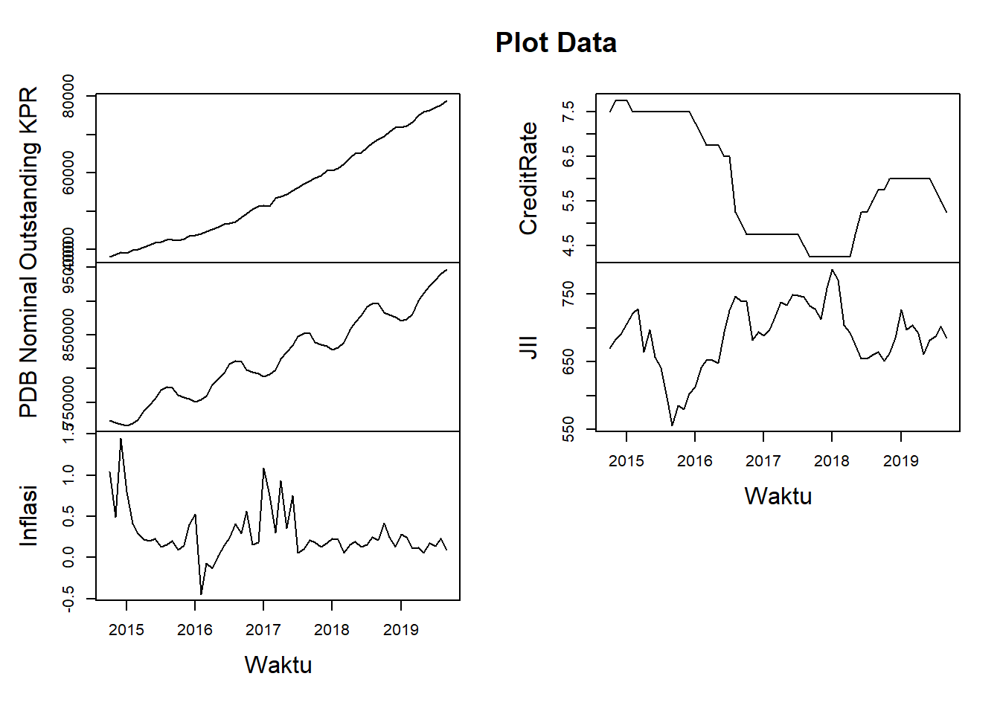

# Basic Linear Regression
## EDA

```r
library(readxl)
#> Warning: package 'readxl' was built under R version 4.2.3
data1 <- read_excel("Data/Bab 2/data1.xlsx")
head(data1)
#> # A tibble: 6 × 11
#>   Time                `Outstanding KPR (miliar)` LnKPR
#>   <dttm>                                   <dbl> <dbl>
#> 1 2014-10-01 00:00:00                     38047.  10.5
#> 2 2014-11-01 00:00:00                     38526.  10.6
#> 3 2014-12-01 00:00:00                     39221.  10.6
#> 4 2015-01-01 00:00:00                     39023.  10.6
#> 5 2015-02-01 00:00:00                     39756.  10.6
#> 6 2015-03-01 00:00:00                     39954.  10.6
#> # ℹ 8 more variables: `PDB Nominal` <dbl>, LnPDB <dbl>,
#> #   `Growth PDB YtY` <dbl>, Inflasi <dbl>,
#> #   CreditRate <dbl>, JII <dbl>, LnJII <dbl>, DFTV <dbl>
```


```r
names(data1)[2] <- "Outstanding KPR"
names(data1)[7] <- "Inflasi"
names(data1)[8] <- "CreditRate"
```


```r
data1baru = data1[,c(2,4,7,8,9)]
tsData = ts(data1baru, start=c(2014,10), frequency=12)
head(tsData,5)
#>      Outstanding KPR PDB Nominal Inflasi CreditRate    JII
#> [1,]        38047.46    723517.8    1.04       7.50 670.44
#> [2,]        38525.78    719995.7    0.49       7.75 683.02
#> [3,]        39220.50    718039.5    1.45       7.75 691.04
#> [4,]        39022.75    715580.1    0.80       7.75 706.68
#> [5,]        39755.80    718307.4    0.41       7.50 722.10
```

```r
# Exploration
plot(tsData, type="l", main="Plot Data", xlab="Waktu")
```



```r
# correlation
round(cor(tsData),3)
#>                 Outstanding KPR PDB Nominal Inflasi
#> Outstanding KPR           1.000       0.968  -0.267
#> PDB Nominal               0.968       1.000  -0.315
#> Inflasi                  -0.267      -0.315   1.000
#> CreditRate               -0.548      -0.590   0.074
#> JII                       0.218       0.204   0.179
#>                 CreditRate    JII
#> Outstanding KPR     -0.548  0.218
#> PDB Nominal         -0.590  0.204
#> Inflasi              0.074  0.179
#> CreditRate           1.000 -0.624
#> JII                 -0.624  1.000
```

```r
# Descriptive
summary(tsData)
#>  Outstanding KPR  PDB Nominal        Inflasi       
#>  Min.   :38047   Min.   :715580   Min.   :-0.4500  
#>  1st Qu.:43622   1st Qu.:766385   1st Qu.: 0.1300  
#>  Median :53612   Median :812954   Median : 0.2050  
#>  Mean   :55303   Mean   :818266   Mean   : 0.2838  
#>  3rd Qu.:65595   3rd Qu.:871216   3rd Qu.: 0.3125  
#>  Max.   :78998   Max.   :947281   Max.   : 1.4500  
#>    CreditRate         JII       
#>  Min.   :4.250   Min.   :556.1  
#>  1st Qu.:4.750   1st Qu.:659.2  
#>  Median :5.875   Median :691.5  
#>  Mean   :5.896   Mean   :688.1  
#>  3rd Qu.:7.312   3rd Qu.:726.7  
#>  Max.   :7.750   Max.   :787.1
```
## Ordinary Least Square (OLS)

```r
# OLS
regresi1 = lm(LnKPR ~ LnPDB + Inflasi + CreditRate + LnJII + DFTV, data=data1)
summary(regresi1)
#> 
#> Call:
#> lm(formula = LnKPR ~ LnPDB + Inflasi + CreditRate + LnJII + DFTV, 
#>     data = data1)
#> 
#> Residuals:
#>       Min        1Q    Median        3Q       Max 
#> -0.138338 -0.029350  0.004568  0.029305  0.073667 
#> 
#> Coefficients:
#>              Estimate Std. Error t value Pr(>|t|)    
#> (Intercept) -21.79826    2.19407  -9.935 8.61e-14 ***
#> LnPDB         2.29744    0.14887  15.432  < 2e-16 ***
#> Inflasi      -0.02407    0.02223  -1.083 0.283737    
#> CreditRate    0.04397    0.01081   4.067 0.000156 ***
#> LnJII         0.16152    0.10803   1.495 0.140715    
#> DFTV          0.18359    0.03372   5.444 1.31e-06 ***
#> ---
#> Signif. codes:  
#> 0 '***' 0.001 '**' 0.01 '*' 0.05 '.' 0.1 ' ' 1
#> 
#> Residual standard error: 0.04381 on 54 degrees of freedom
#> Multiple R-squared:  0.9659,	Adjusted R-squared:  0.9627 
#> F-statistic: 305.6 on 5 and 54 DF,  p-value: < 2.2e-16
```

## Diagnostic Gauss Markov


```r
# Normality, Linearity, Heteroscedasticity
library(gvlma)
gvlma(regresi1)
#> 
#> Call:
#> lm(formula = LnKPR ~ LnPDB + Inflasi + CreditRate + LnJII + DFTV, 
#>     data = data1)
#> 
#> Coefficients:
#> (Intercept)        LnPDB      Inflasi   CreditRate  
#>   -21.79826      2.29744     -0.02407      0.04397  
#>       LnJII         DFTV  
#>     0.16152      0.18359  
#> 
#> 
#> ASSESSMENT OF THE LINEAR MODEL ASSUMPTIONS
#> USING THE GLOBAL TEST ON 4 DEGREES-OF-FREEDOM:
#> Level of Significance =  0.05 
#> 
#> Call:
#>  gvlma(x = regresi1) 
#> 
#>                      Value p-value                Decision
#> Global Stat        7.04469 0.13355 Assumptions acceptable.
#> Skewness           3.60383 0.05765 Assumptions acceptable.
#> Kurtosis           0.86268 0.35299 Assumptions acceptable.
#> Link Function      2.52749 0.11188 Assumptions acceptable.
#> Heteroscedasticity 0.05069 0.82187 Assumptions acceptable.
```


```r
# Heteroscedasticity Test
library(car)
#> Warning: package 'car' was built under R version 4.2.3
#> Loading required package: carData
# White test
ncvTest(regresi1)
#> Non-constant Variance Score Test 
#> Variance formula: ~ fitted.values 
#> Chisquare = 0.4905034, Df = 1, p = 0.4837
```


```r
# Autocorrelation Test
library(lmtest)
#> Loading required package: zoo
#> Warning: package 'zoo' was built under R version 4.2.3
#> 
#> Attaching package: 'zoo'
#> The following objects are masked from 'package:base':
#> 
#>     as.Date, as.Date.numeric
dwtest(regresi1)
#> 
#> 	Durbin-Watson test
#> 
#> data:  regresi1
#> DW = 0.58729, p-value = 9.399e-13
#> alternative hypothesis: true autocorrelation is greater than 0
```


```r
# Assumption: No perfect multicollinearity
vif(regresi1)
#>      LnPDB    Inflasi CreditRate      LnJII       DFTV 
#>   4.011533   1.412398   5.368989   1.828592   8.404443
```


```r
# Re-estimate Standard Error
library(sandwich)
#> Warning: package 'sandwich' was built under R version 4.2.3
# Account for heteroskedasticity
coeftest(regresi1, vcov = vcovHC(regresi1, "HC1"))
#> 
#> t test of coefficients:
#> 
#>               Estimate Std. Error  t value  Pr(>|t|)    
#> (Intercept) -21.798262   1.581079 -13.7870 < 2.2e-16 ***
#> LnPDB         2.297444   0.118364  19.4100 < 2.2e-16 ***
#> Inflasi      -0.024070   0.019603  -1.2279    0.2248    
#> CreditRate    0.043970   0.009386   4.6846 1.937e-05 ***
#> LnJII         0.161515   0.099960   1.6158    0.1120    
#> DFTV          0.183586   0.028221   6.5052 2.615e-08 ***
#> ---
#> Signif. codes:  
#> 0 '***' 0.001 '**' 0.01 '*' 0.05 '.' 0.1 ' ' 1
```

```r
# Account for heteroskedasticity and autocorrelation
coeftest(regresi1, vcov = vcovHAC)
#> 
#> t test of coefficients:
#> 
#>               Estimate Std. Error  t value  Pr(>|t|)    
#> (Intercept) -21.798262   1.500741 -14.5250 < 2.2e-16 ***
#> LnPDB         2.297444   0.134419  17.0917 < 2.2e-16 ***
#> Inflasi      -0.024070   0.020238  -1.1894  0.239504    
#> CreditRate    0.043970   0.016296   2.6981  0.009286 ** 
#> LnJII         0.161515   0.117986   1.3689  0.176686    
#> DFTV          0.183586   0.041167   4.4595 4.197e-05 ***
#> ---
#> Signif. codes:  
#> 0 '***' 0.001 '**' 0.01 '*' 0.05 '.' 0.1 ' ' 1
```
