# Univariate Time Series
## Data EDA

```r
library(readxl)
#> Warning: package 'readxl' was built under R version 4.2.3
hargaberas <- read_excel("Data/Bab 3/ARIMA.xlsx")
hargaberas = hargaberas[,c(-1)]
hargaberas = ts(hargaberas, start=c(2012,1), frequency=12)
hargaberas
#>        Jan   Feb   Mar   Apr   May   Jun   Jul   Aug   Sep
#> 2012  8726  8778  8687  8583  8537  8554  8606  8635  8624
#> 2013  8835  8843  8783  8711  8681  8784  9018  9057  9058
#> 2014  9433  9531  9596  9425  9414  9462  9525  9525  9694
#> 2015 10612 10766 10987 10648 10569 10679 10732 10935 11055
#> 2016 11614 11729 11678 11449 11417 11469 11498 11475 11448
#> 2017 11579 11571 11494 11449 11465 11465 11448 11411 11482
#> 2018 12276 12414 12299 12035 11943 11907 11936 11899 11900
#>        Oct   Nov   Dec
#> 2012  8624  8655  8702
#> 2013  9108  9152  9262
#> 2014  9781  9924 10344
#> 2015 11169 11365 11465
#> 2016 11433 11450 11476
#> 2017 11552 11665 11838
#> 2018 11926 12013 12106
```


```r
plot(hargaberas, main="Harga Beras di Perdagangan Besar")
```

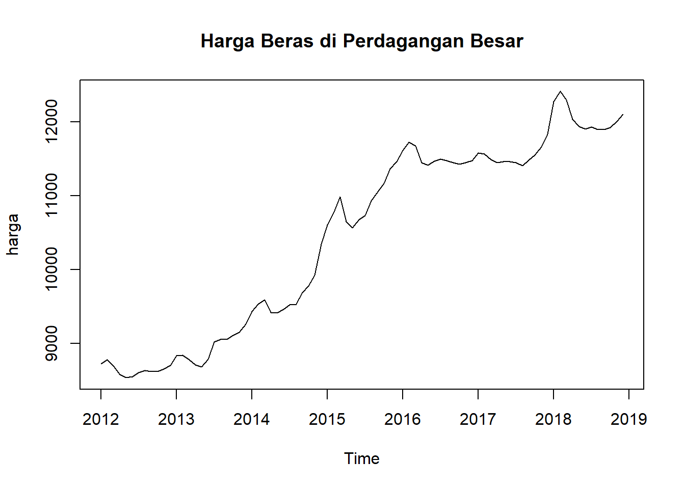

```r
dekomposisi = decompose(hargaberas)
plot(dekomposisi)
```

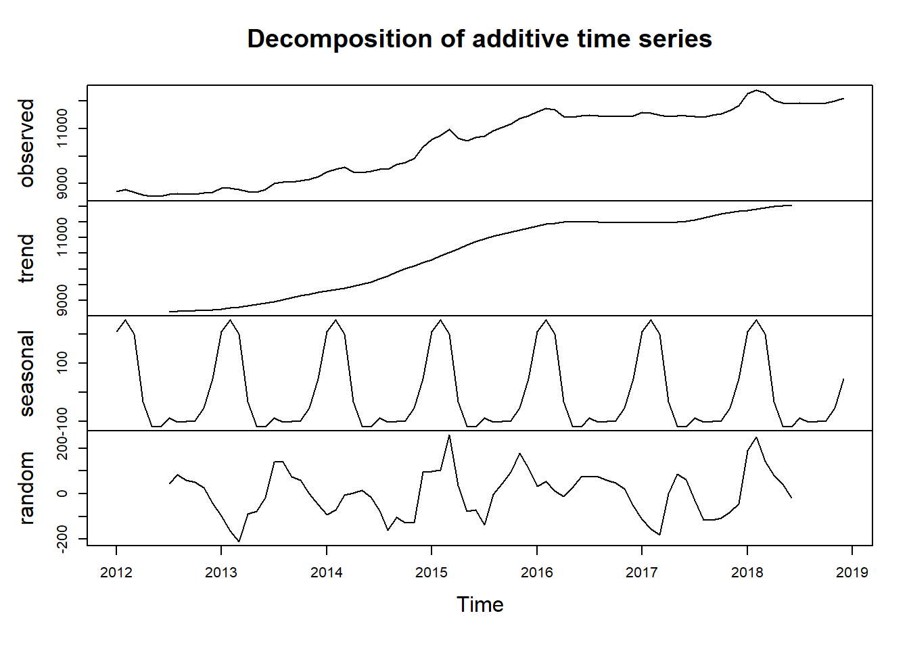
## ACF and PACF Plot

```r
# plot acf dan pacf
par(mfrow=c(2,1))
acf(hargaberas, lag=48)
pacf(hargaberas, lag=48)
```

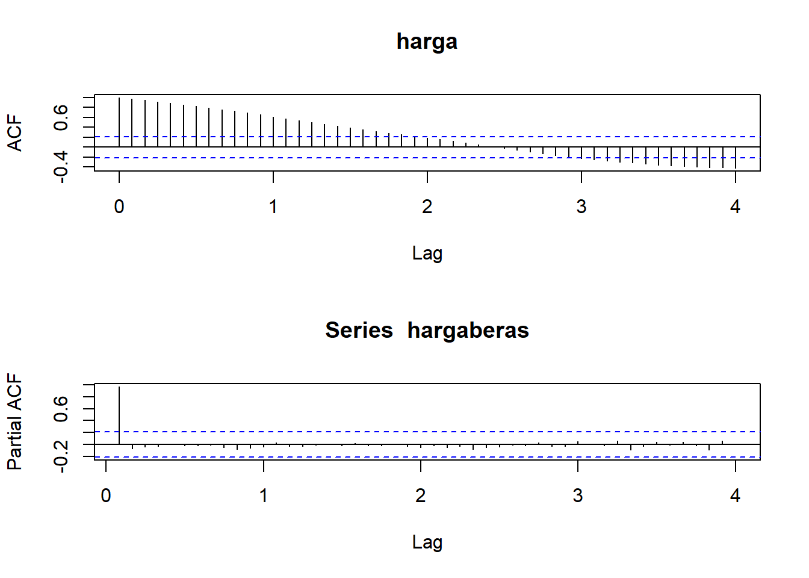
##Stationary Test

```r
library(aTSA)
#> Warning: package 'aTSA' was built under R version 4.2.3
#> 
#> Attaching package: 'aTSA'
#> The following object is masked from 'package:graphics':
#> 
#>     identify
# Augmented Dickey-Fuller Test 
adf.test(hargaberas)
#> Augmented Dickey-Fuller Test 
#> alternative: stationary 
#>  
#> Type 1: no drift no trend 
#>      lag  ADF p.value
#> [1,]   0 2.96   0.990
#> [2,]   1 1.65   0.975
#> [3,]   2 2.04   0.990
#> [4,]   3 2.18   0.990
#> Type 2: with drift no trend 
#>      lag    ADF p.value
#> [1,]   0 -0.537   0.858
#> [2,]   1 -0.717   0.795
#> [3,]   2 -0.831   0.755
#> [4,]   3 -0.917   0.724
#> Type 3: with drift and trend 
#>      lag   ADF p.value
#> [1,]   0 -1.42   0.814
#> [2,]   1 -2.56   0.340
#> [3,]   2 -2.00   0.570
#> [4,]   3 -1.78   0.663
#> ---- 
#> Note: in fact, p.value = 0.01 means p.value <= 0.01
```


```r
# Firs Difference Form
adf.test(diff(hargaberas))
#> Augmented Dickey-Fuller Test 
#> alternative: stationary 
#>  
#> Type 1: no drift no trend 
#>      lag   ADF p.value
#> [1,]   0 -5.11    0.01
#> [2,]   1 -5.02    0.01
#> [3,]   2 -4.42    0.01
#> [4,]   3 -4.36    0.01
#> Type 2: with drift no trend 
#>      lag   ADF p.value
#> [1,]   0 -5.47    0.01
#> [2,]   1 -5.58    0.01
#> [3,]   2 -5.10    0.01
#> [4,]   3 -5.27    0.01
#> Type 3: with drift and trend 
#>      lag   ADF p.value
#> [1,]   0 -5.43    0.01
#> [2,]   1 -5.55    0.01
#> [3,]   2 -5.10    0.01
#> [4,]   3 -5.28    0.01
#> ---- 
#> Note: in fact, p.value = 0.01 means p.value <= 0.01
```
## ARIMA

```r
library(forecast)
#> Warning: package 'forecast' was built under R version 4.2.3
#> Registered S3 method overwritten by 'quantmod':
#>   method            from
#>   as.zoo.data.frame zoo
#> 
#> Attaching package: 'forecast'
#> The following object is masked from 'package:aTSA':
#> 
#>     forecast
auto.arima(hargaberas, trace=TRUE)
#> 
#>  ARIMA(2,1,2)(1,1,1)[12]                    : Inf
#>  ARIMA(0,1,0)(0,1,0)[12]                    : 884.0934
#>  ARIMA(1,1,0)(1,1,0)[12]                    : 872.3993
#>  ARIMA(0,1,1)(0,1,1)[12]                    : Inf
#>  ARIMA(1,1,0)(0,1,0)[12]                    : 876.5573
#>  ARIMA(1,1,0)(2,1,0)[12]                    : 863.6643
#>  ARIMA(1,1,0)(2,1,1)[12]                    : Inf
#>  ARIMA(1,1,0)(1,1,1)[12]                    : Inf
#>  ARIMA(0,1,0)(2,1,0)[12]                    : 867.3178
#>  ARIMA(2,1,0)(2,1,0)[12]                    : 865.871
#>  ARIMA(1,1,1)(2,1,0)[12]                    : 865.1084
#>  ARIMA(0,1,1)(2,1,0)[12]                    : 862.9856
#>  ARIMA(0,1,1)(1,1,0)[12]                    : 871.9363
#>  ARIMA(0,1,1)(2,1,1)[12]                    : Inf
#>  ARIMA(0,1,1)(1,1,1)[12]                    : Inf
#>  ARIMA(0,1,2)(2,1,0)[12]                    : 861.8543
#>  ARIMA(0,1,2)(1,1,0)[12]                    : 872.2305
#>  ARIMA(0,1,2)(2,1,1)[12]                    : Inf
#>  ARIMA(0,1,2)(1,1,1)[12]                    : Inf
#>  ARIMA(1,1,2)(2,1,0)[12]                    : 867.0498
#>  ARIMA(0,1,3)(2,1,0)[12]                    : 854.8026
#>  ARIMA(0,1,3)(1,1,0)[12]                    : 865.2557
#>  ARIMA(0,1,3)(2,1,1)[12]                    : Inf
#>  ARIMA(0,1,3)(1,1,1)[12]                    : Inf
#>  ARIMA(1,1,3)(2,1,0)[12]                    : Inf
#>  ARIMA(0,1,4)(2,1,0)[12]                    : 857.2177
#>  ARIMA(1,1,4)(2,1,0)[12]                    : 859.7882
#> 
#>  Best model: ARIMA(0,1,3)(2,1,0)[12]
#> Series: hargaberas 
#> ARIMA(0,1,3)(2,1,0)[12] 
#> 
#> Coefficients:
#>          ma1     ma2     ma3     sar1     sar2
#>       0.3775  0.0028  0.4180  -0.4831  -0.4956
#> s.e.  0.1166  0.1301  0.1403   0.1231   0.1239
#> 
#> sigma^2 = 7757:  log likelihood = -420.75
#> AIC=853.49   AICc=854.8   BIC=867.07
```

```r
library(lmtest)
#> Loading required package: zoo
#> Warning: package 'zoo' was built under R version 4.2.3
#> 
#> Attaching package: 'zoo'
#> The following objects are masked from 'package:base':
#> 
#>     as.Date, as.Date.numeric
# Best model: ARIMA(0,1,3)(2,1,0)[12]
model1 = arima(hargaberas, order=c(0,1,3), seasonal=list(order=c(2,1,0), period=12))
coeftest(model1)
#> 
#> z test of coefficients:
#> 
#>       Estimate Std. Error z value  Pr(>|z|)    
#> ma1   0.377526   0.116627  3.2370  0.001208 ** 
#> ma2   0.002799   0.130115  0.0215  0.982837    
#> ma3   0.417985   0.140264  2.9800  0.002883 ** 
#> sar1 -0.483126   0.123055 -3.9261 8.634e-05 ***
#> sar2 -0.495630   0.123883 -4.0008 6.313e-05 ***
#> ---
#> Signif. codes:  
#> 0 '***' 0.001 '**' 0.01 '*' 0.05 '.' 0.1 ' ' 1
```


```r
# Arch Test
arch.test(model1)
#> ARCH heteroscedasticity test for residuals 
#> alternative: heteroscedastic 
#> 
#> Portmanteau-Q test: 
#>      order    PQ p.value
#> [1,]     4  5.41   0.247
#> [2,]     8  8.53   0.384
#> [3,]    12 11.36   0.498
#> [4,]    16 13.03   0.670
#> [5,]    20 14.44   0.808
#> [6,]    24 16.04   0.887
#> Lagrange-Multiplier test: 
#>      order    LM  p.value
#> [1,]     4 41.16 6.04e-09
#> [2,]     8 13.84 5.42e-02
#> [3,]    12  6.06 8.69e-01
#> [4,]    16  3.39 9.99e-01
#> [5,]    20  2.16 1.00e+00
#> [6,]    24  1.16 1.00e+00
```

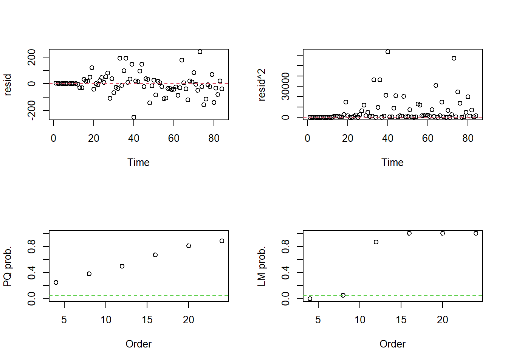


```r
# Autocorrelartion Test
Box.test(model1$residuals, lag = 1, type = c("Ljung-Box"), fitdf = 0)
#> 
#> 	Box-Ljung test
#> 
#> data:  model1$residuals
#> X-squared = 0.0041444, df = 1, p-value = 0.9487
```


```r
# Forecasting
forecast(model1, h=12)
#>          Point Forecast    Lo 80    Hi 80    Lo 95    Hi 95
#> Jan 2019       12355.67 12246.95 12464.39 12189.39 12521.95
#> Feb 2019       12493.09 12308.02 12678.16 12210.05 12776.13
#> Mar 2019       12392.80 12154.53 12631.07 12028.40 12757.21
#> Apr 2019       12143.41 11835.19 12451.63 11672.03 12614.80
#> May 2019       12079.80 11714.79 12444.80 11521.57 12638.02
#> Jun 2019       12086.96 11672.89 12501.04 11453.70 12720.23
#> Jul 2019       12116.54 11658.63 12574.45 11416.22 12816.85
#> Aug 2019       12086.48 11588.57 12584.38 11325.00 12847.96
#> Sep 2019       12072.73 11537.81 12607.64 11254.64 12890.81
#> Oct 2019       12077.85 11508.32 12647.38 11206.83 12948.88
#> Nov 2019       12129.83 11527.68 12731.99 11208.92 13050.75
#> Dec 2019       12188.63 11555.52 12821.73 11220.38 13156.88
```


```r
plot(forecast(model1, h=12))
```

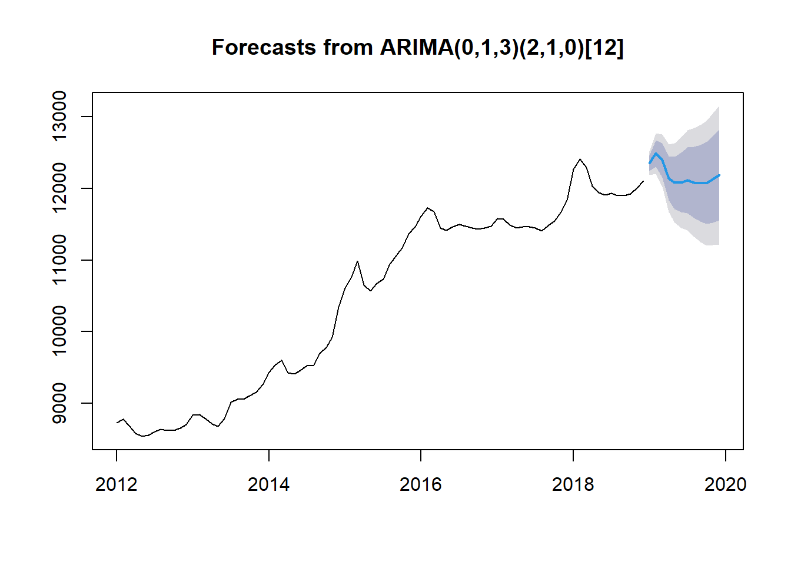

## ARCH-GARCH


```r
library(readxl)
kurs <- read_excel("Data/Bab 3/ARCH-GARCH.xlsx")
kurs = kurs[,c(-1)]
Dates = seq(as.Date("2019-01-01"), as.Date("2020-12-31"), "day") 

library(xts)
#> Warning: package 'xts' was built under R version 4.2.3
kurs = xts(kurs, order.by = Dates)
plot(kurs, main="Nilai Tukar US Dollar terhadap Rupiah")
```

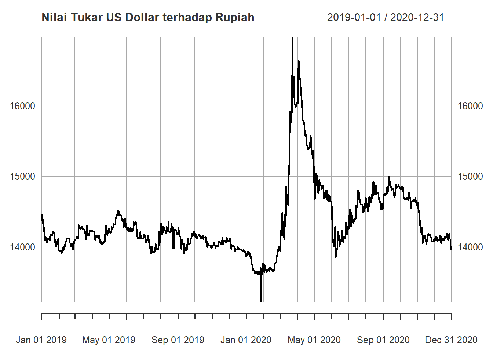


```r
# ARIMA
auto.arima(kurs, trace=TRUE)
#> 
#>  Fitting models using approximations to speed things up...
#> 
#>  ARIMA(2,1,2) with drift         : 8738.664
#>  ARIMA(0,1,0) with drift         : 8755.631
#>  ARIMA(1,1,0) with drift         : 8745.702
#>  ARIMA(0,1,1) with drift         : 8744.836
#>  ARIMA(0,1,0)                    : 8753.644
#>  ARIMA(1,1,2) with drift         : 8742.017
#>  ARIMA(2,1,1) with drift         : 8748.12
#>  ARIMA(3,1,2) with drift         : 8746.649
#>  ARIMA(2,1,3) with drift         : 8740.697
#>  ARIMA(1,1,1) with drift         : 8746.629
#>  ARIMA(1,1,3) with drift         : 8743.813
#>  ARIMA(3,1,1) with drift         : 8748.657
#>  ARIMA(3,1,3) with drift         : 8751.34
#>  ARIMA(2,1,2)                    : 8736.651
#>  ARIMA(1,1,2)                    : 8740.011
#>  ARIMA(2,1,1)                    : 8746.122
#>  ARIMA(3,1,2)                    : 8744.611
#>  ARIMA(2,1,3)                    : 8738.68
#>  ARIMA(1,1,1)                    : 8744.657
#>  ARIMA(1,1,3)                    : 8741.802
#>  ARIMA(3,1,1)                    : 8746.636
#>  ARIMA(3,1,3)                    : 8749.317
#> 
#>  Now re-fitting the best model(s) without approximations...
#> 
#>  ARIMA(2,1,2)                    : 8739.165
#> 
#>  Best model: ARIMA(2,1,2)
#> Series: kurs 
#> ARIMA(2,1,2) 
#> 
#> Coefficients:
#>          ar1      ar2      ma1     ma2
#>       1.2304  -0.7997  -1.3560  0.8726
#> s.e.  0.0650   0.0506   0.0599  0.0425
#> 
#> sigma^2 = 9181:  log likelihood = -4364.54
#> AIC=8739.08   AICc=8739.16   BIC=8762.05
```


```r
#  Best model: ARIMA(2,1,2)
model2 = arima(kurs, order=c(2,1,2))
coeftest(model2)
#> 
#> z test of coefficients:
#> 
#>      Estimate Std. Error z value  Pr(>|z|)    
#> ar1  1.230421   0.065027  18.922 < 2.2e-16 ***
#> ar2 -0.799713   0.050577 -15.812 < 2.2e-16 ***
#> ma1 -1.355960   0.059905 -22.635 < 2.2e-16 ***
#> ma2  0.872641   0.042457  20.554 < 2.2e-16 ***
#> ---
#> Signif. codes:  
#> 0 '***' 0.001 '**' 0.01 '*' 0.05 '.' 0.1 ' ' 1
```

```r
# ARCH Test
arch.test(model2)
#> ARCH heteroscedasticity test for residuals 
#> alternative: heteroscedastic 
#> 
#> Portmanteau-Q test: 
#>      order    PQ p.value
#> [1,]     4  70.7 1.6e-14
#> [2,]     8 134.2 0.0e+00
#> [3,]    12 188.4 0.0e+00
#> [4,]    16 206.3 0.0e+00
#> [5,]    20 216.8 0.0e+00
#> [6,]    24 225.0 0.0e+00
#> Lagrange-Multiplier test: 
#>      order   LM  p.value
#> [1,]     4 1471 0.00e+00
#> [2,]     8  446 0.00e+00
#> [3,]    12  251 0.00e+00
#> [4,]    16  179 0.00e+00
#> [5,]    20  135 0.00e+00
#> [6,]    24  106 1.14e-12
```

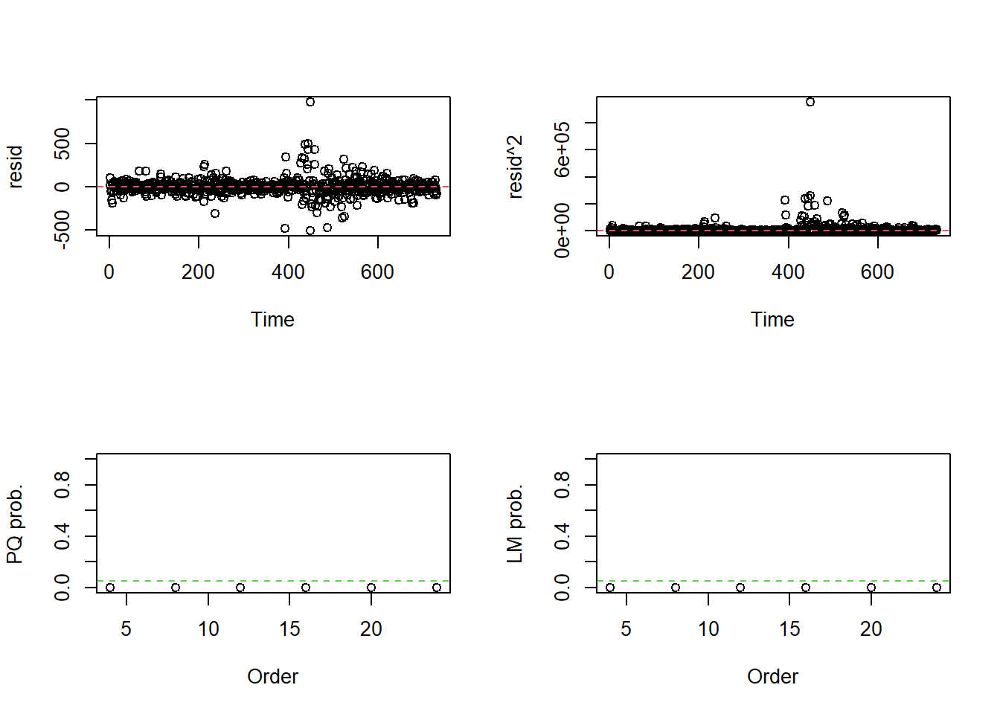
if p.value <- 0.05 = ARCH/GARCH


```r
library(fGarch)
#> Warning: package 'fGarch' was built under R version 4.2.3
#> NOTE: Packages 'fBasics', 'timeDate', and 'timeSeries' are no longer
#> attached to the search() path when 'fGarch' is attached.
#> 
#> If needed attach them yourself in your R script by e.g.,
#>         require("timeSeries")
```


```r
# Stationary Test
# Phillips-Perron Unit Root Test 
pp.test(kurs)
#> Phillips-Perron Unit Root Test 
#> alternative: stationary 
#>  
#> Type 1: no drift no trend 
#>  lag   Z_rho p.value
#>    6 -0.0408   0.683
#> ----- 
#>  Type 2: with drift no trend 
#>  lag Z_rho p.value
#>    6 -11.1   0.107
#> ----- 
#>  Type 3: with drift and trend 
#>  lag Z_rho p.value
#>    6 -12.1   0.367
#> --------------- 
#> Note: p-value = 0.01 means p.value <= 0.01
pp.test(diff(kurs))
#> Phillips-Perron Unit Root Test 
#> alternative: stationary 
#>  
#> Type 1: no drift no trend 
#>  lag Z_rho p.value
#>    6  -804    0.01
#> ----- 
#>  Type 2: with drift no trend 
#>  lag Z_rho p.value
#>    6  -804    0.01
#> ----- 
#>  Type 3: with drift and trend 
#>  lag Z_rho p.value
#>    6  -804    0.01
#> --------------- 
#> Note: p-value = 0.01 means p.value <= 0.01
```


```r
e = diff(kurs)[-1]
par(mfrow=c(1,1))
acf(e)
```

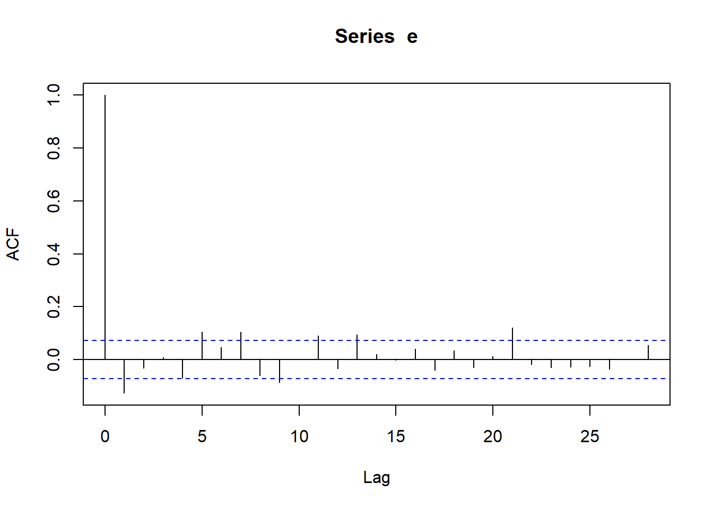

```r
pacf(e)
```

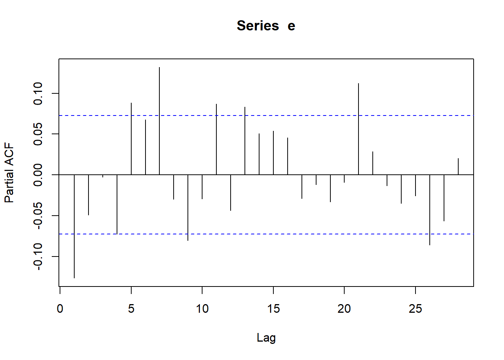

```r
plot(e)
```

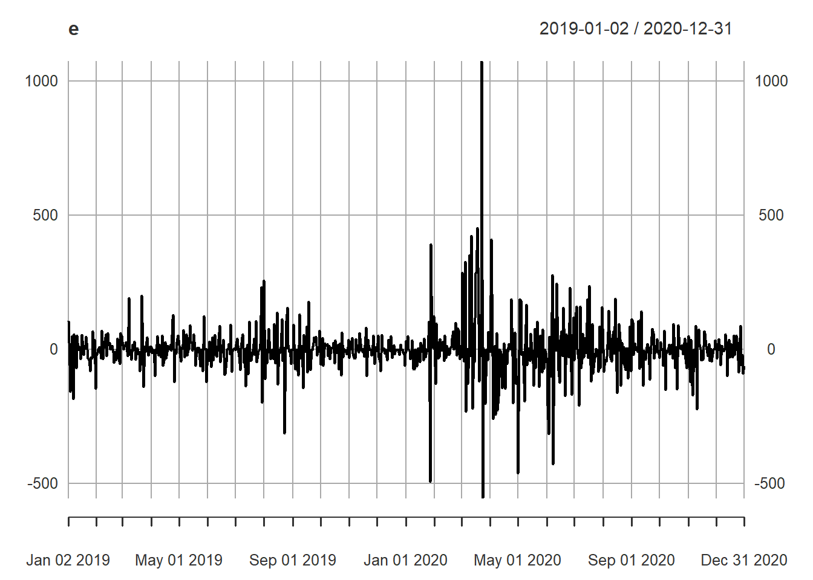


```r
# ARCH(1) = GARCH(1,0)
model10 = garchFit(~garch(1,0), data=e, trace=FALSE)
summary(model10)
#> 
#> Title:
#>  GARCH Modelling 
#> 
#> Call:
#>  garchFit(formula = ~garch(1, 0), data = e, trace = FALSE) 
#> 
#> Mean and Variance Equation:
#>  data ~ garch(1, 0)
#> <environment: 0x000002dce167b308>
#>  [data = e]
#> 
#> Conditional Distribution:
#>  norm 
#> 
#> Coefficient(s):
#>         mu       omega      alpha1  
#>   -1.15887  5442.67260     0.61303  
#> 
#> Std. Errors:
#>  based on Hessian 
#> 
#> Error Analysis:
#>         Estimate  Std. Error  t value Pr(>|t|)    
#> mu       -1.1589      2.8293   -0.410    0.682    
#> omega  5442.6726    374.5058   14.533  < 2e-16 ***
#> alpha1    0.6130      0.1073    5.713 1.11e-08 ***
#> ---
#> Signif. codes:  
#> 0 '***' 0.001 '**' 0.01 '*' 0.05 '.' 0.1 ' ' 1
#> 
#> Log Likelihood:
#>  -4303.768    normalized:  -5.895573 
#> 
#> Description:
#>  Tue Apr  2 18:23:56 2024 by user: derik 
#> 
#> 
#> Standardised Residuals Tests:
#>                                   Statistic      p-Value
#>  Jarque-Bera Test   R    Chi^2  4839.704454 0.000000e+00
#>  Shapiro-Wilk Test  R    W         0.839958 0.000000e+00
#>  Ljung-Box Test     R    Q(10)    29.630084 9.844469e-04
#>  Ljung-Box Test     R    Q(15)    39.676117 5.074432e-04
#>  Ljung-Box Test     R    Q(20)    41.959542 2.799349e-03
#>  Ljung-Box Test     R^2  Q(10)    91.109411 3.219647e-15
#>  Ljung-Box Test     R^2  Q(15)   147.246211 0.000000e+00
#>  Ljung-Box Test     R^2  Q(20)   159.654019 0.000000e+00
#>  LM Arch Test       R    TR^2    114.581427 0.000000e+00
#> 
#> Information Criterion Statistics:
#>      AIC      BIC      SIC     HQIC 
#> 11.79937 11.81824 11.79933 11.80665
```


```r
# GARCH(1,1)
model11 = garchFit(~garch(1,1), data=e, trace=FALSE)
summary(model11)
#> 
#> Title:
#>  GARCH Modelling 
#> 
#> Call:
#>  garchFit(formula = ~garch(1, 1), data = e, trace = FALSE) 
#> 
#> Mean and Variance Equation:
#>  data ~ garch(1, 1)
#> <environment: 0x000002dcdd0f4c88>
#>  [data = e]
#> 
#> Conditional Distribution:
#>  norm 
#> 
#> Coefficient(s):
#>        mu      omega     alpha1      beta1  
#>  -2.41759  366.97243    0.25035    0.74326  
#> 
#> Std. Errors:
#>  based on Hessian 
#> 
#> Error Analysis:
#>         Estimate  Std. Error  t value Pr(>|t|)    
#> mu      -2.41759     2.21121   -1.093    0.274    
#> omega  366.97243    87.52212    4.193 2.75e-05 ***
#> alpha1   0.25035     0.04215    5.940 2.85e-09 ***
#> beta1    0.74326     0.03132   23.734  < 2e-16 ***
#> ---
#> Signif. codes:  
#> 0 '***' 0.001 '**' 0.01 '*' 0.05 '.' 0.1 ' ' 1
#> 
#> Log Likelihood:
#>  -4188.199    normalized:  -5.73726 
#> 
#> Description:
#>  Tue Apr  2 18:23:57 2024 by user: derik 
#> 
#> 
#> Standardised Residuals Tests:
#>                                    Statistic     p-Value
#>  Jarque-Bera Test   R    Chi^2  1527.8453918 0.000000000
#>  Shapiro-Wilk Test  R    W         0.9121068 0.000000000
#>  Ljung-Box Test     R    Q(10)    28.3515449 0.001585409
#>  Ljung-Box Test     R    Q(15)    31.1437861 0.008403721
#>  Ljung-Box Test     R    Q(20)    32.4515824 0.038717821
#>  Ljung-Box Test     R^2  Q(10)     4.8877686 0.898547890
#>  Ljung-Box Test     R^2  Q(15)     9.1420869 0.869971665
#>  Ljung-Box Test     R^2  Q(20)    11.4700910 0.933109272
#>  LM Arch Test       R    TR^2      5.5858039 0.935507008
#> 
#> Information Criterion Statistics:
#>      AIC      BIC      SIC     HQIC 
#> 11.48548 11.51065 11.48542 11.49519
```


```r
# GARCH(1,1) with mean equation ARMA(0,1)
model11b = garchFit(~arma(0,1)+garch(1,1), data=e, trace=FALSE)
summary(model11b)
#> 
#> Title:
#>  GARCH Modelling 
#> 
#> Call:
#>  garchFit(formula = ~arma(0, 1) + garch(1, 1), data = e, trace = FALSE) 
#> 
#> Mean and Variance Equation:
#>  data ~ arma(0, 1) + garch(1, 1)
#> <environment: 0x000002dcd966c250>
#>  [data = e]
#> 
#> Conditional Distribution:
#>  norm 
#> 
#> Coefficient(s):
#>        mu        ma1      omega     alpha1      beta1  
#>  -2.53982   -0.22537  337.43876    0.23716    0.75465  
#> 
#> Std. Errors:
#>  based on Hessian 
#> 
#> Error Analysis:
#>         Estimate  Std. Error  t value Pr(>|t|)    
#> mu      -2.53982     1.74379   -1.456    0.145    
#> ma1     -0.22537     0.04724   -4.771 1.83e-06 ***
#> omega  337.43876    85.21204    3.960 7.50e-05 ***
#> alpha1   0.23716     0.04038    5.874 4.26e-09 ***
#> beta1    0.75465     0.03129   24.118  < 2e-16 ***
#> ---
#> Signif. codes:  
#> 0 '***' 0.001 '**' 0.01 '*' 0.05 '.' 0.1 ' ' 1
#> 
#> Log Likelihood:
#>  -4177.446    normalized:  -5.722529 
#> 
#> Description:
#>  Tue Apr  2 18:23:57 2024 by user: derik 
#> 
#> 
#> Standardised Residuals Tests:
#>                                    Statistic    p-Value
#>  Jarque-Bera Test   R    Chi^2  1331.0510666 0.00000000
#>  Shapiro-Wilk Test  R    W         0.9147019 0.00000000
#>  Ljung-Box Test     R    Q(10)    20.1208930 0.02812976
#>  Ljung-Box Test     R    Q(15)    23.9601552 0.06577322
#>  Ljung-Box Test     R    Q(20)    26.1490497 0.16094547
#>  Ljung-Box Test     R^2  Q(10)     4.7499032 0.90724638
#>  Ljung-Box Test     R^2  Q(15)     8.8134669 0.88706688
#>  Ljung-Box Test     R^2  Q(20)    11.6275315 0.92829976
#>  LM Arch Test       R    TR^2      5.4233826 0.94232413
#> 
#> Information Criterion Statistics:
#>      AIC      BIC      SIC     HQIC 
#> 11.45876 11.49021 11.45866 11.47089
```


```r
# Best Model = "model11b"
Dates2 = seq(as.Date("2019-01-02"), as.Date("2020-12-31"), "day") 
stdev = xts(model11b@sigma.t, order.by = Dates2)
plot(stdev, main="Simpangan Baku")
```

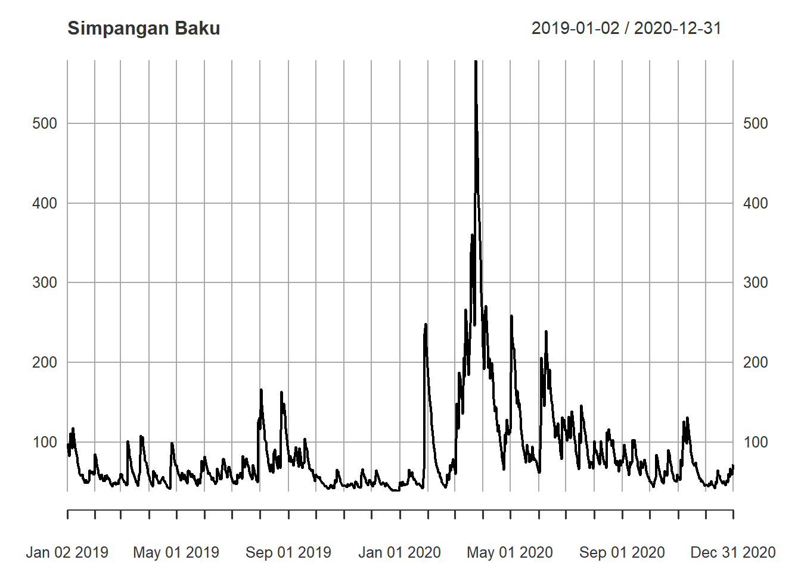


```r
# Forecasting
predict(model11b, n.ahead=20, plot=TRUE, nx=731)
```

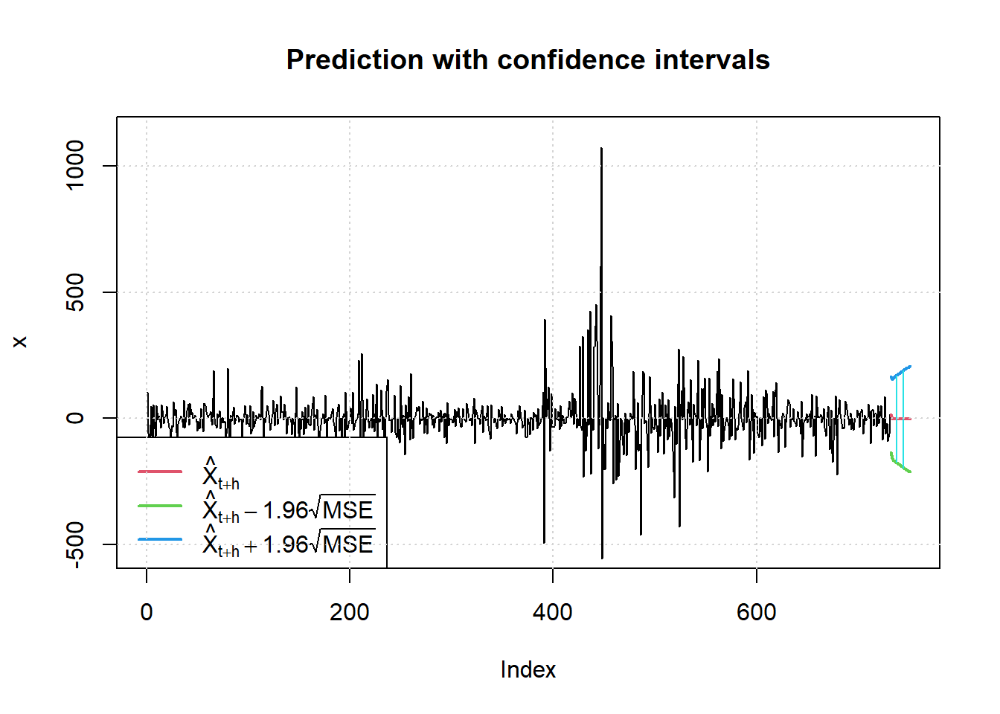

```
#>    meanForecast meanError standardDeviation lowerInterval
#> 1     15.748251  76.11087          76.11087     -133.4263
#> 2     -2.539819  79.85676          77.99279     -159.0562
#> 3     -2.539819  81.72802          79.81549     -162.7238
#> 4     -2.539819  83.54257          81.58306     -166.2802
#> 5     -2.539819  85.30415          83.29911     -169.7329
#> 6     -2.539819  87.01608          84.96689     -173.0882
#> 7     -2.539819  88.68137          86.58929     -176.3521
#> 8     -2.539819  90.30269          88.16892     -179.5298
#> 9     -2.539819  91.88248          89.70815     -182.6262
#> 10    -2.539819  93.42296          91.20912     -185.6454
#> 11    -2.539819  94.92613          92.67380     -188.5916
#> 12    -2.539819  96.39384          94.10397     -191.4683
#> 13    -2.539819  97.82780          95.50128     -194.2788
#> 14    -2.539819  99.22954          96.86724     -197.0261
#> 15    -2.539819 100.60052          98.20325     -199.7132
#> 16    -2.539819 101.94206          99.51061     -202.3426
#> 17    -2.539819 103.25541         100.79051     -204.9167
#> 18    -2.539819 104.54171         102.04409     -207.4378
#> 19    -2.539819 105.80203         103.27236     -209.9080
#> 20    -2.539819 107.03737         104.47632     -212.3292
#>    upperInterval
#> 1       164.9228
#> 2       153.9765
#> 3       157.6442
#> 4       161.2006
#> 5       164.6532
#> 6       168.0086
#> 7       171.2725
#> 8       174.4502
#> 9       177.5465
#> 10      180.5658
#> 11      183.5120
#> 12      186.3886
#> 13      189.1991
#> 14      191.9465
#> 15      194.6336
#> 16      197.2630
#> 17      199.8371
#> 18      202.3582
#> 19      204.8283
#> 20      207.2496
```


