#  Multivariate Time Series
## VAR/VECM


```r
library(readxl)
#> Warning: package 'readxl' was built under R version 4.2.3
data1 <- read_excel("Data/Bab 4/VECM.xlsx")
tsdata = data1[,c(-1,-2,-3,-4)]
tsdata = ts(tsdata, start=c(2010,1), frequency=12)
plot(tsdata)
```


```r
# Stationary Test
library(aTSA)
#> Warning: package 'aTSA' was built under R version 4.2.3
#> 
#> Attaching package: 'aTSA'
#> The following object is masked from 'package:graphics':
#> 
#>     identify
adf.test(tsdata[,"LnIHK"])
#> Augmented Dickey-Fuller Test 
#> alternative: stationary 
#>  
#> Type 1: no drift no trend 
#>      lag  ADF p.value
#> [1,]   0 3.25    0.99
#> [2,]   1 7.29    0.99
#> [3,]   2 3.75    0.99
#> [4,]   3 5.84    0.99
#> Type 2: with drift no trend 
#>      lag    ADF p.value
#> [1,]   0 -0.506   0.869
#> [2,]   1 -0.541   0.856
#> [3,]   2 -0.727   0.791
#> [4,]   3 -0.914   0.725
#> Type 3: with drift and trend 
#>      lag   ADF p.value
#> [1,]   0 -5.31  0.0100
#> [2,]   1 -2.02  0.5601
#> [3,]   2 -3.33  0.0732
#> [4,]   3 -1.77  0.6648
#> ---- 
#> Note: in fact, p.value = 0.01 means p.value <= 0.01
adf.test(tsdata[,"LnRM2"])
#> Augmented Dickey-Fuller Test 
#> alternative: stationary 
#>  
#> Type 1: no drift no trend 
#>      lag  ADF p.value
#> [1,]   0 3.09    0.99
#> [2,]   1 4.89    0.99
#> [3,]   2 4.21    0.99
#> [4,]   3 4.52    0.99
#> Type 2: with drift no trend 
#>      lag   ADF p.value
#> [1,]   0 -1.53   0.509
#> [2,]   1 -2.12   0.284
#> [3,]   2 -2.04   0.315
#> [4,]   3 -2.39   0.177
#> Type 3: with drift and trend 
#>      lag   ADF p.value
#> [1,]   0 -2.31   0.441
#> [2,]   1 -1.50   0.776
#> [3,]   2 -1.36   0.836
#> [4,]   3 -1.09   0.918
#> ---- 
#> Note: in fact, p.value = 0.01 means p.value <= 0.01
adf.test(tsdata[,"LnIPI"])
#> Augmented Dickey-Fuller Test 
#> alternative: stationary 
#>  
#> Type 1: no drift no trend 
#>      lag  ADF p.value
#> [1,]   0 1.03   0.916
#> [2,]   1 1.45   0.961
#> [3,]   2 1.81   0.981
#> [4,]   3 2.09   0.990
#> Type 2: with drift no trend 
#>      lag    ADF p.value
#> [1,]   0 -1.588   0.487
#> [2,]   1 -1.069   0.671
#> [3,]   2 -0.493   0.873
#> [4,]   3 -0.218   0.927
#> Type 3: with drift and trend 
#>      lag   ADF p.value
#> [1,]   0 -6.68    0.01
#> [2,]   1 -5.35    0.01
#> [3,]   2 -4.47    0.01
#> [4,]   3 -4.11    0.01
#> ---- 
#> Note: in fact, p.value = 0.01 means p.value <= 0.01
```


```r
adf.test(diff(tsdata[,"LnIHK"]))
#> Augmented Dickey-Fuller Test 
#> alternative: stationary 
#>  
#> Type 1: no drift no trend 
#>      lag    ADF p.value
#> [1,]   0 -15.36    0.01
#> [2,]   1  -3.52    0.01
#> [3,]   2  -4.20    0.01
#> [4,]   3  -2.61    0.01
#> Type 2: with drift no trend 
#>      lag    ADF p.value
#> [1,]   0 -21.22    0.01
#> [2,]   1  -5.37    0.01
#> [3,]   2  -7.78    0.01
#> [4,]   3  -5.55    0.01
#> Type 3: with drift and trend 
#>      lag    ADF p.value
#> [1,]   0 -21.09    0.01
#> [2,]   1  -5.36    0.01
#> [3,]   2  -7.79    0.01
#> [4,]   3  -5.59    0.01
#> ---- 
#> Note: in fact, p.value = 0.01 means p.value <= 0.01
adf.test(diff(tsdata[,"LnRM2"]))
#> Augmented Dickey-Fuller Test 
#> alternative: stationary 
#>  
#> Type 1: no drift no trend 
#>      lag    ADF p.value
#> [1,]   0 -11.73    0.01
#> [2,]   1  -5.61    0.01
#> [3,]   2  -4.49    0.01
#> [4,]   3  -3.31    0.01
#> Type 2: with drift no trend 
#>      lag    ADF p.value
#> [1,]   0 -14.27    0.01
#> [2,]   1  -7.53    0.01
#> [3,]   2  -6.83    0.01
#> [4,]   3  -5.62    0.01
#> Type 3: with drift and trend 
#>      lag    ADF p.value
#> [1,]   0 -14.60    0.01
#> [2,]   1  -7.85    0.01
#> [3,]   2  -7.34    0.01
#> [4,]   3  -6.33    0.01
#> ---- 
#> Note: in fact, p.value = 0.01 means p.value <= 0.01
adf.test(diff(tsdata[,"LnIPI"]))
#> Augmented Dickey-Fuller Test 
#> alternative: stationary 
#>  
#> Type 1: no drift no trend 
#>      lag    ADF p.value
#> [1,]   0 -12.46    0.01
#> [2,]   1  -9.27    0.01
#> [3,]   2  -7.24    0.01
#> [4,]   3  -5.75    0.01
#> Type 2: with drift no trend 
#>      lag    ADF p.value
#> [1,]   0 -12.64    0.01
#> [2,]   1  -9.59    0.01
#> [3,]   2  -7.70    0.01
#> [4,]   3  -6.32    0.01
#> Type 3: with drift and trend 
#>      lag    ADF p.value
#> [1,]   0 -12.56    0.01
#> [2,]   1  -9.54    0.01
#> [3,]   2  -7.67    0.01
#> [4,]   3  -6.31    0.01
#> ---- 
#> Note: in fact, p.value = 0.01 means p.value <= 0.01
```


```r
library(urca)
library(vars)
#> Warning: package 'vars' was built under R version 4.2.3
#> Loading required package: MASS
#> Warning: package 'MASS' was built under R version 4.2.3
#> Loading required package: strucchange
#> Loading required package: zoo
#> Warning: package 'zoo' was built under R version 4.2.3
#> 
#> Attaching package: 'zoo'
#> The following objects are masked from 'package:base':
#> 
#>     as.Date, as.Date.numeric
#> Loading required package: sandwich
#> Warning: package 'sandwich' was built under R version 4.2.3
#> Loading required package: lmtest
#> 
#> Attaching package: 'vars'
#> The following object is masked from 'package:aTSA':
#> 
#>     arch.test

# Lag Optimum
VARselect(tsdata, lag.max = 10)
#> $selection
#> AIC(n)  HQ(n)  SC(n) FPE(n) 
#>      9      2      2      9 
#> 
#> $criteria
#>                    1             2             3
#> AIC(n) -2.454158e+01 -2.517704e+01 -2.527724e+01
#> HQ(n)  -2.438847e+01 -2.490910e+01 -2.489447e+01
#> SC(n)  -2.415612e+01 -2.450249e+01 -2.431360e+01
#> FPE(n)  2.197302e-11  1.165805e-11  1.058765e-11
#>                    4             5             6
#> AIC(n) -2.529876e+01 -2.531948e+01 -2.531117e+01
#> HQ(n)  -2.480116e+01 -2.470705e+01 -2.458391e+01
#> SC(n)  -2.404603e+01 -2.377765e+01 -2.348025e+01
#> FPE(n)  1.043683e-11  1.034191e-11  1.060910e-11
#>                    7             8             9
#> AIC(n) -2.509185e+01 -2.516992e+01 -2.557138e+01
#> HQ(n)  -2.424976e+01 -2.421299e+01 -2.449963e+01
#> SC(n)  -2.297184e+01 -2.276081e+01 -2.287319e+01
#> FPE(n)  1.353419e-11  1.293440e-11  9.038835e-12
#>                   10
#> AIC(n) -2.549790e+01
#> HQ(n)  -2.431131e+01
#> SC(n)  -2.251061e+01
#> FPE(n)  1.028471e-11
```


```r
# Cointegration Test
cointest_eigen = ca.jo(tsdata, K=2, type="eigen", ecdet="const", spec="longrun")
summary(cointest_eigen)
#> 
#> ###################### 
#> # Johansen-Procedure # 
#> ###################### 
#> 
#> Test type: maximal eigenvalue statistic (lambda max) , without linear trend and constant in cointegration 
#> 
#> Eigenvalues (lambda):
#> [1]  5.404113e-01  2.481996e-01  6.245216e-02 -2.633450e-15
#> 
#> Values of teststatistic and critical values of test:
#> 
#>           test 10pct  5pct  1pct
#> r <= 2 |  5.03  7.52  9.24 12.97
#> r <= 1 | 22.25 13.75 15.67 20.20
#> r = 0  | 60.64 19.77 22.00 26.81
#> 
#> Eigenvectors, normalised to first column:
#> (These are the cointegration relations)
#> 
#>            LnIHK.l2    LnRM2.l2   LnIPI.l2   constant
#> LnIHK.l2  1.0000000  1.00000000  1.0000000  1.0000000
#> LnRM2.l2 -0.1153114  0.08719842 -1.0510635 -0.6085127
#> LnIPI.l2 -0.8107822 -1.31468643  0.2406645  0.1913803
#> constant  0.4060887  0.96758544  4.8089173  0.5277719
#> 
#> Weights W:
#> (This is the loading matrix)
#> 
#>            LnIHK.l2    LnRM2.l2    LnIPI.l2      constant
#> LnIHK.d -0.07391103 -0.02494780 -0.03114995 -2.034556e-13
#> LnRM2.d -0.06399547  0.08952368  0.07223974  4.136568e-13
#> LnIPI.d -0.01046286  0.46857303 -0.03192575  8.440672e-13
```


```r
# VECM
modelvecm = cajorls(cointest_eigen)
```


```r
summary(modelvecm$rlm)
#> Response LnIHK.d :
#> 
#> Call:
#> lm(formula = LnIHK.d ~ ect1 + LnIHK.dl1 + LnRM2.dl1 + LnIPI.dl1 - 
#>     1, data = data.mat)
#> 
#> Residuals:
#>       Min        1Q    Median        3Q       Max 
#> -0.015021 -0.005668 -0.001157  0.003871  0.027827 
#> 
#> Coefficients:
#>           Estimate Std. Error t value Pr(>|t|)    
#> ect1      -0.07391    0.01199  -6.166 3.37e-08 ***
#> LnIHK.dl1 -0.70491    0.10168  -6.933 1.31e-09 ***
#> LnRM2.dl1  0.08470    0.06861   1.234    0.221    
#> LnIPI.dl1 -0.01593    0.02695  -0.591    0.556    
#> ---
#> Signif. codes:  
#> 0 '***' 0.001 '**' 0.01 '*' 0.05 '.' 0.1 ' ' 1
#> 
#> Residual standard error: 0.008005 on 74 degrees of freedom
#> Multiple R-squared:  0.6302,	Adjusted R-squared:  0.6102 
#> F-statistic: 31.53 on 4 and 74 DF,  p-value: 2.518e-15
#> 
#> 
#> Response LnRM2.d :
#> 
#> Call:
#> lm(formula = LnRM2.d ~ ect1 + LnIHK.dl1 + LnRM2.dl1 + LnIPI.dl1 - 
#>     1, data = data.mat)
#> 
#> Residuals:
#>       Min        1Q    Median        3Q       Max 
#> -0.030921 -0.011339  0.001549  0.010970  0.044395 
#> 
#> Coefficients:
#>           Estimate Std. Error t value Pr(>|t|)   
#> ect1      -0.06400    0.02313  -2.767  0.00715 **
#> LnIHK.dl1  0.33519    0.19621   1.708  0.09177 . 
#> LnRM2.dl1 -0.30552    0.13241  -2.307  0.02383 * 
#> LnIPI.dl1  0.02765    0.05200   0.532  0.59650   
#> ---
#> Signif. codes:  
#> 0 '***' 0.001 '**' 0.01 '*' 0.05 '.' 0.1 ' ' 1
#> 
#> Residual standard error: 0.01545 on 74 degrees of freedom
#> Multiple R-squared:  0.3241,	Adjusted R-squared:  0.2875 
#> F-statistic:  8.87 on 4 and 74 DF,  p-value: 6.604e-06
#> 
#> 
#> Response LnIPI.d :
#> 
#> Call:
#> lm(formula = LnIPI.d ~ ect1 + LnIHK.dl1 + LnRM2.dl1 + LnIPI.dl1 - 
#>     1, data = data.mat)
#> 
#> Residuals:
#>       Min        1Q    Median        3Q       Max 
#> -0.094660 -0.011913  0.000434  0.021986  0.101991 
#> 
#> Coefficients:
#>           Estimate Std. Error t value Pr(>|t|)   
#> ect1      -0.01046    0.05068  -0.206  0.83700   
#> LnIHK.dl1 -0.08499    0.42988  -0.198  0.84383   
#> LnRM2.dl1  0.21190    0.29009   0.730  0.46742   
#> LnIPI.dl1 -0.35319    0.11394  -3.100  0.00274 **
#> ---
#> Signif. codes:  
#> 0 '***' 0.001 '**' 0.01 '*' 0.05 '.' 0.1 ' ' 1
#> 
#> Residual standard error: 0.03385 on 74 degrees of freedom
#> Multiple R-squared:  0.1312,	Adjusted R-squared:  0.08427 
#> F-statistic: 2.794 on 4 and 74 DF,  p-value: 0.03214
```


```r
modelvecm$beta
#>                ect1
#> LnIHK.l2  1.0000000
#> LnRM2.l2 -0.1153114
#> LnIPI.l2 -0.8107822
#> constant  0.4060887
```


```r
vecm = vec2var(cointest_eigen)
```


```r
# IRF
ir = irf(vecm, n.ahead=48)
plot(ir)
```

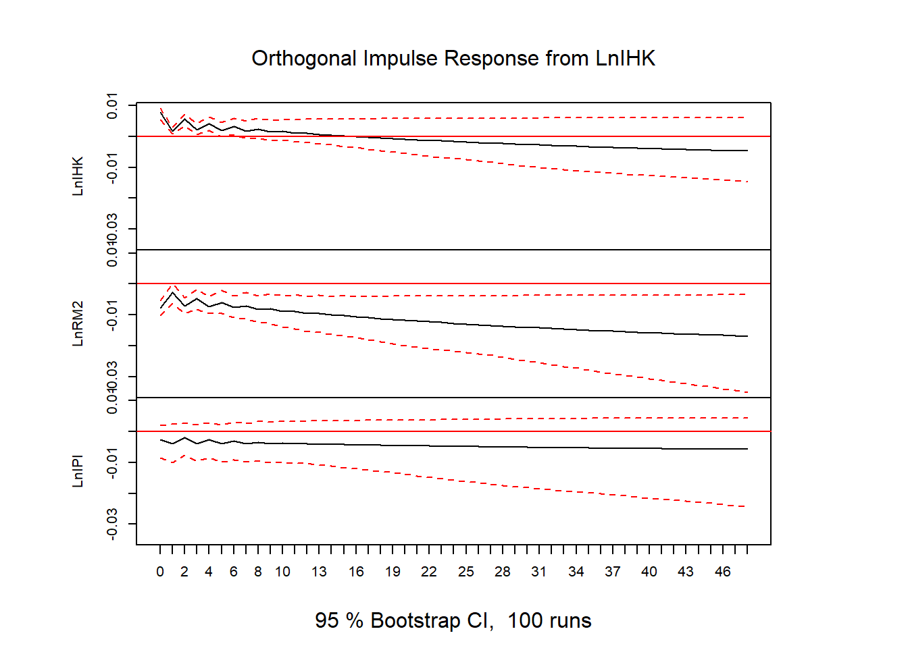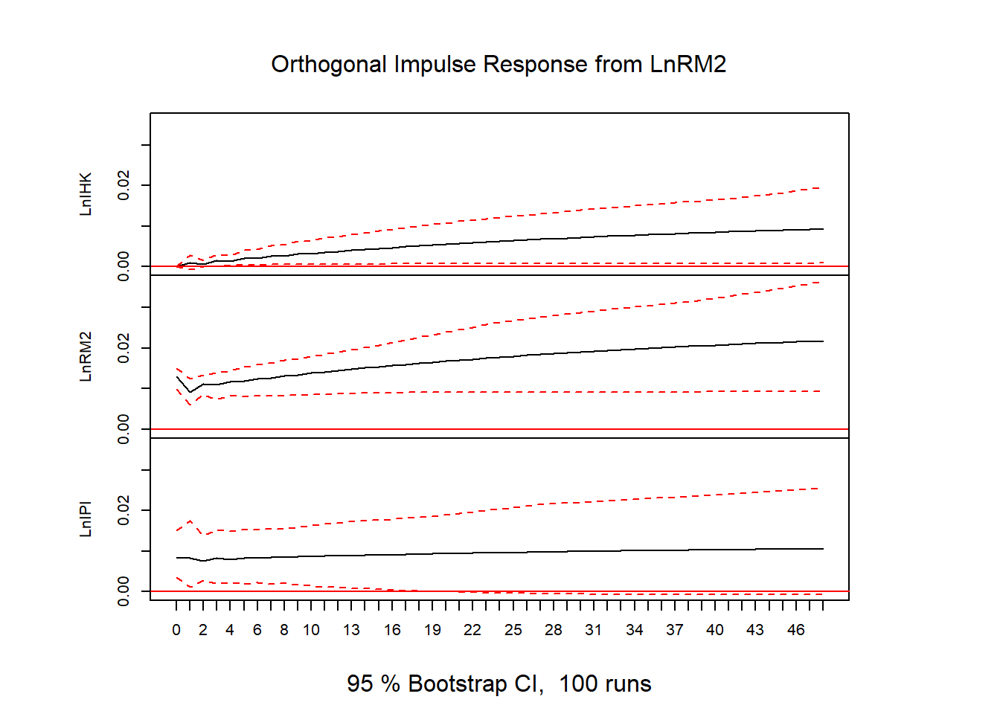


```r
# FEVD
vd = fevd(vecm, n.ahead=48)
plot(vd)
```

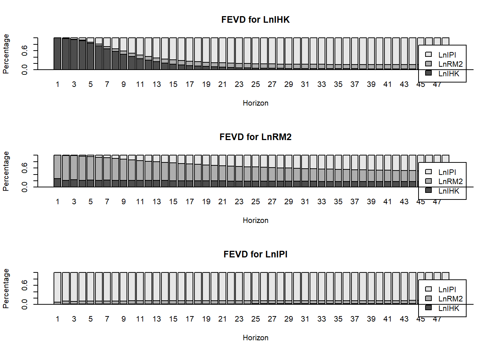


```r
vd_LnIHK = as.matrix(vd$LnIHK)
barplot(t(vd_LnIHK), beside=FALSE, main="FEVD LnIHK", xlab="periode", col=c("blue","red","green"), legend.text=TRUE) 
```

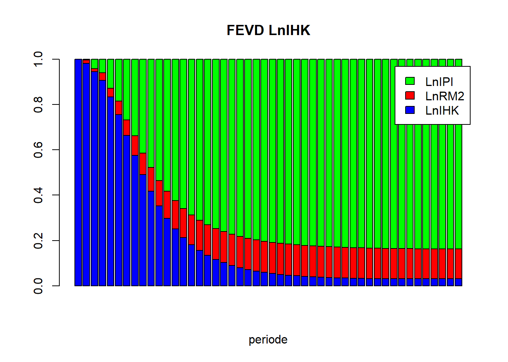


```r
vd_LnRM2 = as.matrix(vd$LnRM2)
barplot(t(vd_LnRM2), beside=FALSE, main="FEVD LnRM2", xlab="periode", col=c("blue","red","green"), legend.text=TRUE)
```

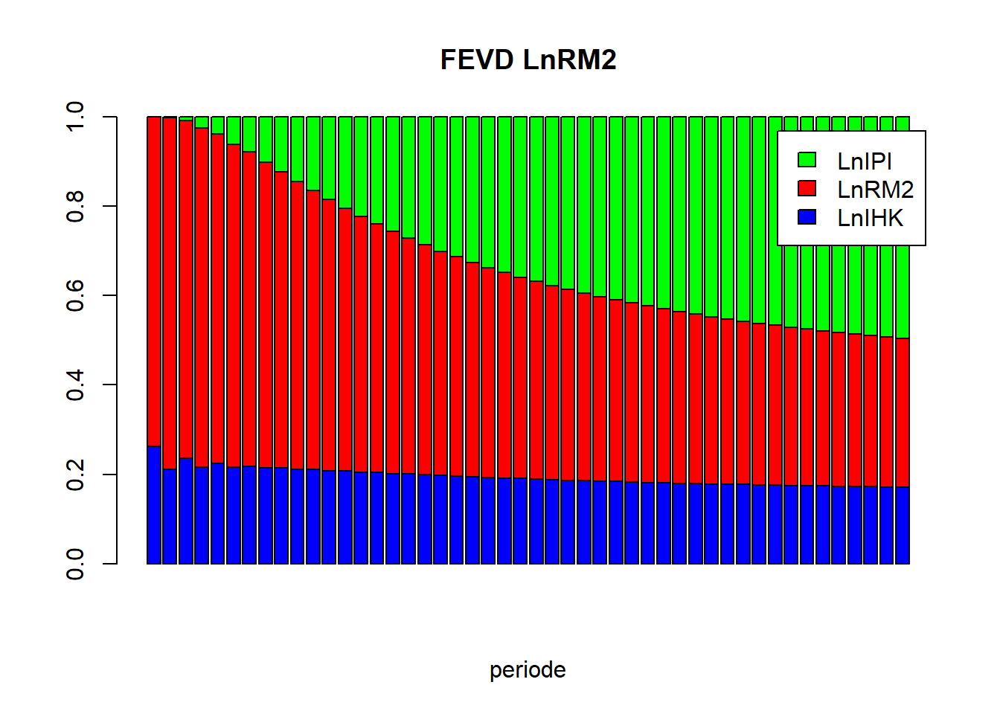


```r
vd_LnIPI = as.matrix(vd$LnIPI)
barplot(t(vd_LnIPI), beside=FALSE, main="FEVD LnIPI", xlab="periode", col=c("blue","red","green"), legend.text=TRUE)
```

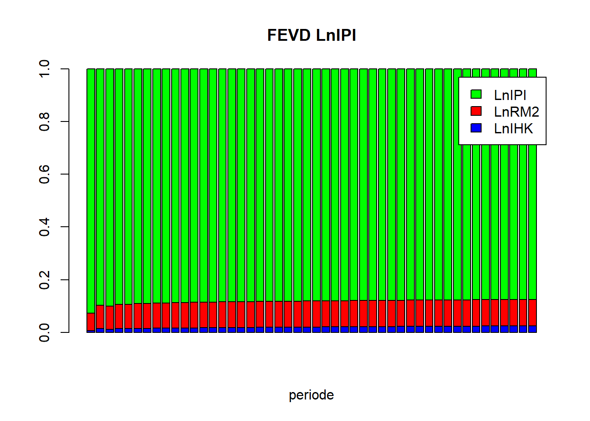


```r
# VAR FD, If No cointegtration
D1LnIHK = diff(tsdata[,"LnIHK"])
D1LnRM2 = diff(tsdata[,"LnRM2"])
D1LnIPI = diff(tsdata[,"LnIPI"])
datadiff = cbind(D1LnIHK, D1LnRM2, D1LnIPI)
plot(datadiff)
```


```r
VARselect(datadiff, lag.max = 10)
#> $selection
#> AIC(n)  HQ(n)  SC(n) FPE(n) 
#>     10      3      1      3 
#> 
#> $criteria
#>                    1             2             3
#> AIC(n) -2.488624e+01 -2.508974e+01 -2.522710e+01
#> HQ(n)  -2.473209e+01 -2.481999e+01 -2.484173e+01
#> SC(n)  -2.449770e+01 -2.440980e+01 -2.425574e+01
#> FPE(n)  1.556733e-11  1.272259e-11  1.113498e-11
#>                    4             5             6
#> AIC(n) -2.513616e+01 -2.494060e+01 -2.490228e+01
#> HQ(n)  -2.463518e+01 -2.432401e+01 -2.417008e+01
#> SC(n)  -2.387340e+01 -2.338644e+01 -2.305671e+01
#> FPE(n)  1.228686e-11  1.512269e-11  1.599877e-11
#>                    7             8             9
#> AIC(n) -2.492141e+01 -2.513204e+01 -2.515552e+01
#> HQ(n)  -2.407360e+01 -2.416862e+01 -2.407649e+01
#> SC(n)  -2.278444e+01 -2.270366e+01 -2.243574e+01
#> FPE(n)  1.609812e-11  1.349591e-11  1.379267e-11
#>                   10
#> AIC(n) -2.527308e+01
#> HQ(n)  -2.407844e+01
#> SC(n)  -2.226189e+01
#> FPE(n)  1.300117e-11
```


```r
varfd = VAR(datadiff, p=3, type="both")
summary(varfd)
#> 
#> VAR Estimation Results:
#> ========================= 
#> Endogenous variables: D1LnIHK, D1LnRM2, D1LnIPI 
#> Deterministic variables: both 
#> Sample size: 76 
#> Log Likelihood: 669.253 
#> Roots of the characteristic polynomial:
#> 0.9777 0.7641 0.7641 0.6842 0.6842 0.6017 0.6017 0.5599 0.1487
#> Call:
#> VAR(y = datadiff, p = 3, type = "both")
#> 
#> 
#> Estimation results for equation D1LnIHK: 
#> ======================================== 
#> D1LnIHK = D1LnIHK.l1 + D1LnRM2.l1 + D1LnIPI.l1 + D1LnIHK.l2 + D1LnRM2.l2 + D1LnIPI.l2 + D1LnIHK.l3 + D1LnRM2.l3 + D1LnIPI.l3 + const + trend 
#> 
#>              Estimate Std. Error t value Pr(>|t|)   
#> D1LnIHK.l1 -2.695e-01  1.136e-01  -2.372  0.02065 * 
#> D1LnRM2.l1  1.048e-01  6.640e-02   1.578  0.11951   
#> D1LnIPI.l1 -2.316e-02  2.636e-02  -0.879  0.38286   
#> D1LnIHK.l2  2.542e-01  1.214e-01   2.095  0.04010 * 
#> D1LnRM2.l2  1.258e-01  6.760e-02   1.861  0.06733 . 
#> D1LnIPI.l2  7.308e-03  2.795e-02   0.261  0.79454   
#> D1LnIHK.l3 -3.575e-01  1.219e-01  -2.933  0.00463 **
#> D1LnRM2.l3  1.015e-01  6.679e-02   1.520  0.13348   
#> D1LnIPI.l3  3.637e-02  2.675e-02   1.360  0.17860   
#> const       3.701e-03  2.760e-03   1.341  0.18469   
#> trend       3.603e-06  3.837e-05   0.094  0.92549   
#> ---
#> Signif. codes:  
#> 0 '***' 0.001 '**' 0.01 '*' 0.05 '.' 0.1 ' ' 1
#> 
#> 
#> Residual standard error: 0.006803 on 65 degrees of freedom
#> Multiple R-Squared: 0.7325,	Adjusted R-squared: 0.6913 
#> F-statistic: 17.79 on 10 and 65 DF,  p-value: 4.614e-15 
#> 
#> 
#> Estimation results for equation D1LnRM2: 
#> ======================================== 
#> D1LnRM2 = D1LnIHK.l1 + D1LnRM2.l1 + D1LnIPI.l1 + D1LnIHK.l2 + D1LnRM2.l2 + D1LnIPI.l2 + D1LnIHK.l3 + D1LnRM2.l3 + D1LnIPI.l3 + const + trend 
#> 
#>              Estimate Std. Error t value Pr(>|t|)    
#> D1LnIHK.l1 -1.023e-01  2.305e-01  -0.444 0.658605    
#> D1LnRM2.l1 -4.005e-01  1.347e-01  -2.973 0.004138 ** 
#> D1LnIPI.l1 -4.924e-03  5.348e-02  -0.092 0.926915    
#> D1LnIHK.l2 -7.711e-01  2.463e-01  -3.131 0.002611 ** 
#> D1LnRM2.l2 -3.981e-01  1.372e-01  -2.902 0.005054 ** 
#> D1LnIPI.l2  4.497e-02  5.671e-02   0.793 0.430615    
#> D1LnIHK.l3  2.169e-01  2.473e-01   0.877 0.383719    
#> D1LnRM2.l3 -1.699e-02  1.355e-01  -0.125 0.900617    
#> D1LnIPI.l3 -4.905e-02  5.427e-02  -0.904 0.369493    
#> const       2.144e-02  5.601e-03   3.829 0.000292 ***
#> trend      -1.726e-04  7.786e-05  -2.217 0.030141 *  
#> ---
#> Signif. codes:  
#> 0 '***' 0.001 '**' 0.01 '*' 0.05 '.' 0.1 ' ' 1
#> 
#> 
#> Residual standard error: 0.0138 on 65 degrees of freedom
#> Multiple R-Squared: 0.4561,	Adjusted R-squared: 0.3724 
#> F-statistic:  5.45 on 10 and 65 DF,  p-value: 7.948e-06 
#> 
#> 
#> Estimation results for equation D1LnIPI: 
#> ======================================== 
#> D1LnIPI = D1LnIHK.l1 + D1LnRM2.l1 + D1LnIPI.l1 + D1LnIHK.l2 + D1LnRM2.l2 + D1LnIPI.l2 + D1LnIHK.l3 + D1LnRM2.l3 + D1LnIPI.l3 + const + trend 
#> 
#>              Estimate Std. Error t value Pr(>|t|)    
#> D1LnIHK.l1 -9.657e-01  5.265e-01  -1.834  0.07121 .  
#> D1LnRM2.l1 -4.073e-02  3.078e-01  -0.132  0.89511    
#> D1LnIPI.l1 -5.834e-01  1.221e-01  -4.776 1.06e-05 ***
#> D1LnIHK.l2 -1.065e+00  5.625e-01  -1.893  0.06284 .  
#> D1LnRM2.l2 -2.528e-01  3.133e-01  -0.807  0.42264    
#> D1LnIPI.l2 -4.311e-01  1.295e-01  -3.328  0.00144 ** 
#> D1LnIHK.l3 -3.630e-01  5.648e-01  -0.643  0.52271    
#> D1LnRM2.l3 -3.290e-01  3.096e-01  -1.063  0.29188    
#> D1LnIPI.l3 -2.070e-01  1.240e-01  -1.670  0.09981 .  
#> const       2.268e-02  1.279e-02   1.773  0.08089 .  
#> trend       4.216e-06  1.778e-04   0.024  0.98116    
#> ---
#> Signif. codes:  
#> 0 '***' 0.001 '**' 0.01 '*' 0.05 '.' 0.1 ' ' 1
#> 
#> 
#> Residual standard error: 0.03153 on 65 degrees of freedom
#> Multiple R-Squared: 0.3186,	Adjusted R-squared: 0.2138 
#> F-statistic: 3.039 on 10 and 65 DF,  p-value: 0.003239 
#> 
#> 
#> 
#> Covariance matrix of residuals:
#>            D1LnIHK    D1LnRM2    D1LnIPI
#> D1LnIHK  4.628e-05 -3.554e-05 -1.799e-06
#> D1LnRM2 -3.554e-05  1.906e-04  8.303e-05
#> D1LnIPI -1.799e-06  8.303e-05  9.941e-04
#> 
#> Correlation matrix of residuals:
#>           D1LnIHK D1LnRM2   D1LnIPI
#> D1LnIHK  1.000000 -0.3785 -0.008387
#> D1LnRM2 -0.378457  1.0000  0.190775
#> D1LnIPI -0.008387  0.1908  1.000000
```


```r
# Stablity VAR
plot(stability(varfd))
```

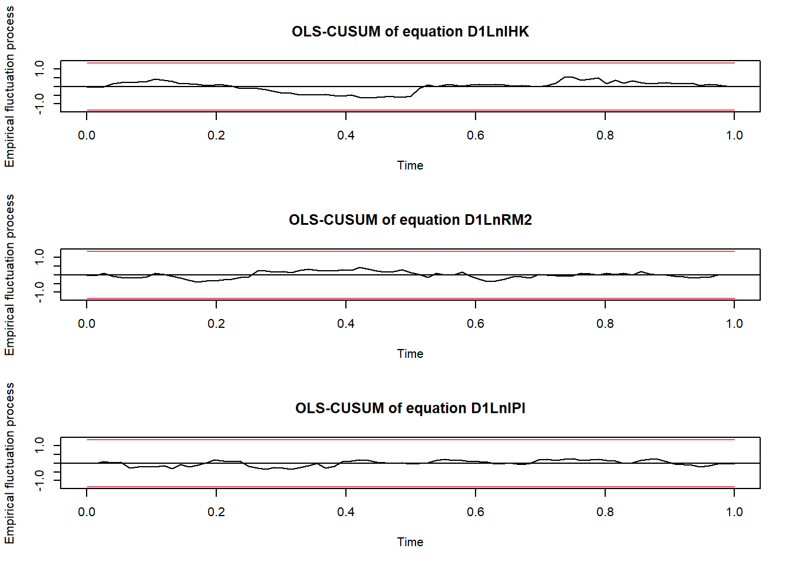


```r
# IRF
impres = irf(varfd, n.ahead=48)
plot(impres)
```

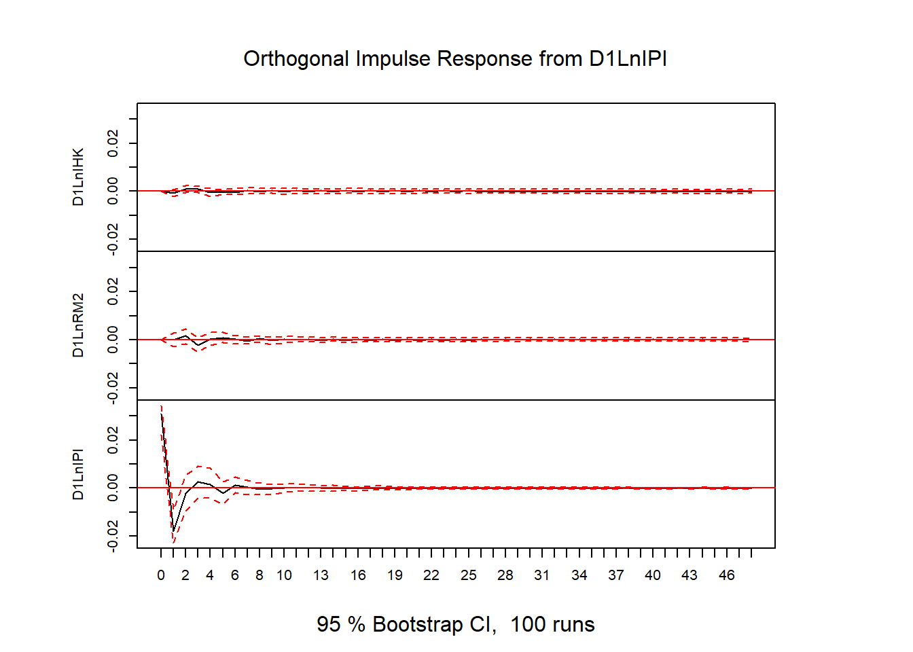
## SVAR

```r
library(readxl)
data1 <- read_excel("Data/Bab 4/SVAR.xlsx")
head(data1)
#> # A tibble: 6 × 4
#>   quarter growth inflation interest
#>   <chr>    <dbl>     <dbl>    <dbl>
#> 1 2006q1    5.13     15.0     12.6 
#> 2 2006q2    4.93     14.8     12.8 
#> 3 2006q3    5.86     14.0     12.4 
#> 4 2006q4    6.06      6.41    11.2 
#> 5 2007q1    6.06      6.34     9.83
#> 6 2007q2    6.73      5.64     9.08
```


```r
tsdata = data1[,c(-1)]
tsdata = ts(tsdata, start=c(2006,1), frequency=4)
plot(tsdata)
```


```r
library(aTSA)
adf.test(tsdata[,"growth"])
#> Augmented Dickey-Fuller Test 
#> alternative: stationary 
#>  
#> Type 1: no drift no trend 
#>      lag    ADF p.value
#> [1,]   0 -0.315   0.550
#> [2,]   1 -0.265   0.564
#> [3,]   2 -0.578   0.469
#> [4,]   3 -0.583   0.467
#> Type 2: with drift no trend 
#>      lag   ADF p.value
#> [1,]   0 -2.34  0.1978
#> [2,]   1 -2.68  0.0874
#> [3,]   2 -2.63  0.0955
#> [4,]   3 -2.25  0.2320
#> Type 3: with drift and trend 
#>      lag   ADF p.value
#> [1,]   0 -3.06  0.1453
#> [2,]   1 -3.74  0.0296
#> [3,]   2 -3.40  0.0647
#> [4,]   3 -3.02  0.1627
#> ---- 
#> Note: in fact, p.value = 0.01 means p.value <= 0.01
adf.test(tsdata[,"inflation"])
#> Augmented Dickey-Fuller Test 
#> alternative: stationary 
#>  
#> Type 1: no drift no trend 
#>      lag   ADF p.value
#> [1,]   0 -2.34  0.0212
#> [2,]   1 -2.37  0.0200
#> [3,]   2 -2.31  0.0227
#> [4,]   3 -1.14  0.2675
#> Type 2: with drift no trend 
#>      lag   ADF p.value
#> [1,]   0 -3.26  0.0236
#> [2,]   1 -3.82  0.0100
#> [3,]   2 -4.50  0.0100
#> [4,]   3 -2.37  0.1887
#> Type 3: with drift and trend 
#>      lag   ADF p.value
#> [1,]   0 -3.46  0.0552
#> [2,]   1 -4.32  0.0100
#> [3,]   2 -5.67  0.0100
#> [4,]   3 -3.86  0.0221
#> ---- 
#> Note: in fact, p.value = 0.01 means p.value <= 0.01
adf.test(tsdata[,"interest"])
#> Augmented Dickey-Fuller Test 
#> alternative: stationary 
#>  
#> Type 1: no drift no trend 
#>      lag   ADF p.value
#> [1,]   0 -2.72  0.0100
#> [2,]   1 -2.02  0.0441
#> [3,]   2 -1.93  0.0532
#> [4,]   3 -1.67  0.0913
#> Type 2: with drift no trend 
#>      lag   ADF p.value
#> [1,]   0 -3.06  0.0391
#> [2,]   1 -3.52  0.0126
#> [3,]   2 -3.33  0.0206
#> [4,]   3 -2.54  0.1232
#> Type 3: with drift and trend 
#>      lag   ADF p.value
#> [1,]   0 -2.49  0.3714
#> [2,]   1 -4.07  0.0133
#> [3,]   2 -3.82  0.0240
#> [4,]   3 -2.90  0.2080
#> ---- 
#> Note: in fact, p.value = 0.01 means p.value <= 0.01
```


```r
#cLag Optimum
library(vars)
VARselect(tsdata, lag.max = 10)
#> $selection
#> AIC(n)  HQ(n)  SC(n) FPE(n) 
#>      2      1      1      2 
#> 
#> $criteria
#>                  1           2           3           4
#> AIC(n) -3.70894477 -3.80592549 -3.69612636 -3.74782971
#> HQ(n)  -3.53024390 -3.49319896 -3.24937417 -3.16705186
#> SC(n)  -3.23190789 -2.97111094 -2.50353415 -2.19745983
#> FPE(n)  0.02453576  0.02239812  0.02535002  0.02471383
#>                  5           6           7           8
#> AIC(n) -3.74823364 -3.50174099 -3.37833948 -3.26151640
#> HQ(n)  -3.03343013 -2.65291182 -2.39548466 -2.14463592
#> SC(n)  -1.84008610 -1.23581578 -0.75463661 -0.28003587
#> FPE(n)  0.02580004  0.03528312  0.04400099  0.05681734
#>                  9          10
#> AIC(n) -3.71876734 -3.74360021
#> HQ(n)  -2.46786120 -2.35866842
#> SC(n)  -0.37950914 -0.04656435
#> FPE(n)  0.04372386  0.05614527
```


```r
# VAR Estimation
var.est1 = VAR(tsdata, p = 2, type = "none")
summary(var.est1)
#> 
#> VAR Estimation Results:
#> ========================= 
#> Endogenous variables: growth, inflation, interest 
#> Deterministic variables: none 
#> Sample size: 54 
#> Log Likelihood: -128.363 
#> Roots of the characteristic polynomial:
#> 0.9909 0.706 0.706 0.4297 0.1321 0.1321
#> Call:
#> VAR(y = tsdata, p = 2, type = "none")
#> 
#> 
#> Estimation results for equation growth: 
#> ======================================= 
#> growth = growth.l1 + inflation.l1 + interest.l1 + growth.l2 + inflation.l2 + interest.l2 
#> 
#>               Estimate Std. Error t value Pr(>|t|)    
#> growth.l1     0.833907   0.134741   6.189 1.29e-07 ***
#> inflation.l1  0.001106   0.033450   0.033   0.9738    
#> interest.l1   0.044345   0.143583   0.309   0.7588    
#> growth.l2     0.035982   0.128753   0.279   0.7811    
#> inflation.l2 -0.095836   0.038141  -2.513   0.0154 *  
#> interest.l2   0.133608   0.114623   1.166   0.2495    
#> ---
#> Signif. codes:  
#> 0 '***' 0.001 '**' 0.01 '*' 0.05 '.' 0.1 ' ' 1
#> 
#> 
#> Residual standard error: 0.3558 on 48 degrees of freedom
#> Multiple R-Squared: 0.9963,	Adjusted R-squared: 0.9959 
#> F-statistic:  2164 on 6 and 48 DF,  p-value: < 2.2e-16 
#> 
#> 
#> Estimation results for equation inflation: 
#> ========================================== 
#> inflation = growth.l1 + inflation.l1 + interest.l1 + growth.l2 + inflation.l2 + interest.l2 
#> 
#>               Estimate Std. Error t value Pr(>|t|)    
#> growth.l1     0.232652   0.602805   0.386    0.701    
#> inflation.l1  0.840256   0.149650   5.615 9.66e-07 ***
#> interest.l1  -0.061073   0.642360  -0.095    0.925    
#> growth.l2     0.115551   0.576015   0.201    0.842    
#> inflation.l2 -0.135143   0.170636  -0.792    0.432    
#> interest.l2   0.002248   0.512801   0.004    0.997    
#> ---
#> Signif. codes:  
#> 0 '***' 0.001 '**' 0.01 '*' 0.05 '.' 0.1 ' ' 1
#> 
#> 
#> Residual standard error: 1.592 on 48 degrees of freedom
#> Multiple R-Squared: 0.9381,	Adjusted R-squared: 0.9304 
#> F-statistic: 121.3 on 6 and 48 DF,  p-value: < 2.2e-16 
#> 
#> 
#> Estimation results for equation interest: 
#> ========================================= 
#> interest = growth.l1 + inflation.l1 + interest.l1 + growth.l2 + inflation.l2 + interest.l2 
#> 
#>              Estimate Std. Error t value Pr(>|t|)    
#> growth.l1     0.20986    0.13119   1.600  0.11622    
#> inflation.l1  0.11010    0.03257   3.381  0.00144 ** 
#> interest.l1   1.12480    0.13979   8.046 1.88e-10 ***
#> growth.l2    -0.06797    0.12536  -0.542  0.59017    
#> inflation.l2 -0.03737    0.03713  -1.006  0.31930    
#> interest.l2  -0.30853    0.11160  -2.765  0.00806 ** 
#> ---
#> Signif. codes:  
#> 0 '***' 0.001 '**' 0.01 '*' 0.05 '.' 0.1 ' ' 1
#> 
#> 
#> Residual standard error: 0.3464 on 48 degrees of freedom
#> Multiple R-Squared: 0.9979,	Adjusted R-squared: 0.9976 
#> F-statistic:  3734 on 6 and 48 DF,  p-value: < 2.2e-16 
#> 
#> 
#> 
#> Covariance matrix of residuals:
#>            growth inflation interest
#> growth    0.12655   0.08828  0.01781
#> inflation 0.08828   2.53321  0.18157
#> interest  0.01781   0.18157  0.11999
#> 
#> Correlation matrix of residuals:
#>           growth inflation interest
#> growth    1.0000    0.1559   0.1445
#> inflation 0.1559    1.0000   0.3293
#> interest  0.1445    0.3293   1.0000
```


```r
# Matriks A for SVAR AB-model
a.mat = diag(3)
diag(a.mat) = NA
a.mat[2,1] = NA
a.mat[3,1] = NA
a.mat[3,2] = NA
a.mat
#>      [,1] [,2] [,3]
#> [1,]   NA    0    0
#> [2,]   NA   NA    0
#> [3,]   NA   NA   NA
```


```r
# Matriks B for SVAR AB-model
b.mat = diag(3)
diag(b.mat) = NA
b.mat
#>      [,1] [,2] [,3]
#> [1,]   NA    0    0
#> [2,]    0   NA    0
#> [3,]    0    0   NA
```


```r
# Est SVAR
svar1 = SVAR(var.est1, Amat = a.mat, Bmat = b.mat, max.iter = 10000, hessian = TRUE)
#> Warning in SVAR(var.est1, Amat = a.mat, Bmat = b.mat,
#> max.iter = 10000, : The AB-model is just identified. No
#> test possible.
svar1
#> 
#> SVAR Estimation Results:
#> ======================== 
#> 
#> 
#> Estimated A matrix:
#>             growth inflation interest
#> growth     1.00000   0.00000        0
#> inflation -0.69543   1.00000        0
#> interest  -0.09344  -0.06834        1
#> 
#> Estimated B matrix:
#>           growth inflation interest
#> growth    0.3558     0.000   0.0000
#> inflation 0.0000     1.573   0.0000
#> interest  0.0000     0.000   0.3255
```


```r
# IRF
inf.int = irf(svar1, response = "interest", impulse = "inflation", n.ahead = 40)
plot(inf.int)
```


```r
inf.gdp = irf(svar1, response = "growth", impulse = "inflation", n.ahead = 40)
plot(inf.gdp)
```

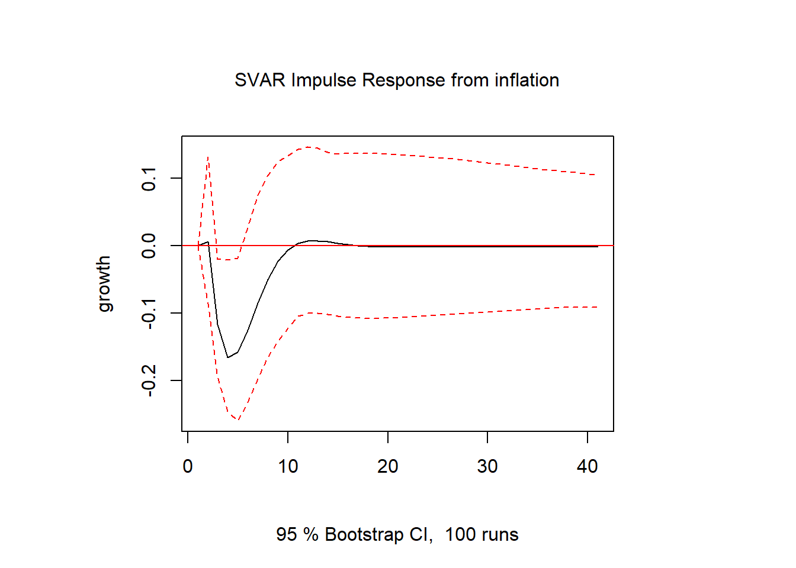

```r
inf.inf = irf(svar1, response = "inflation", impulse = "inflation", n.ahead = 40)
plot(inf.inf)
```

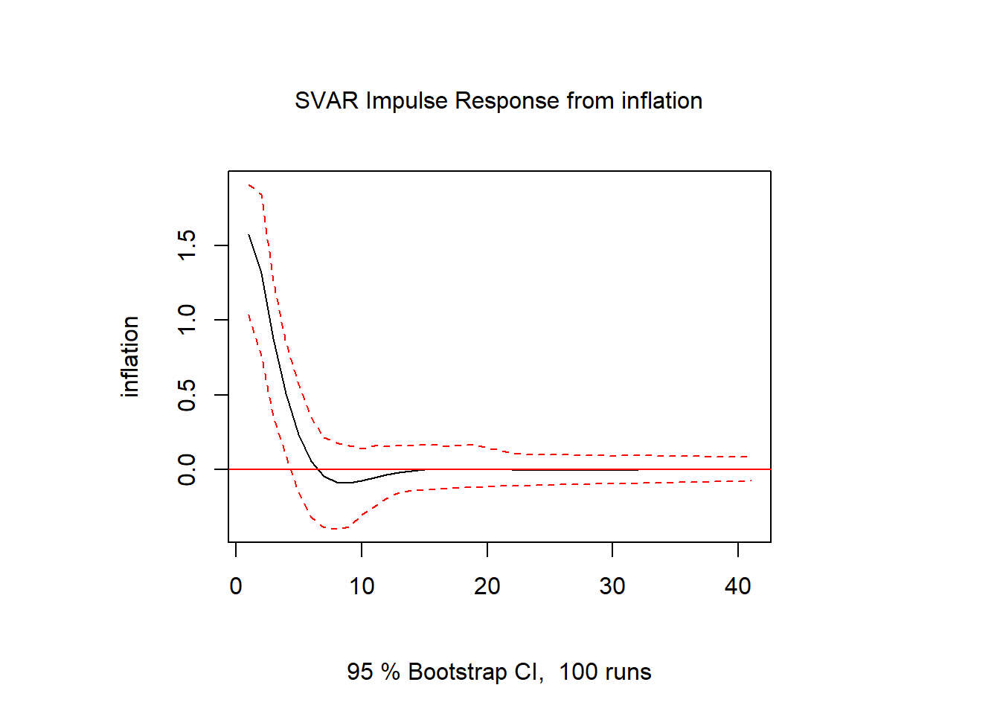

```r
gdp.inf = irf(svar1, response = "inflation", impulse = "growth", n.ahead = 40)
plot(gdp.inf)
```

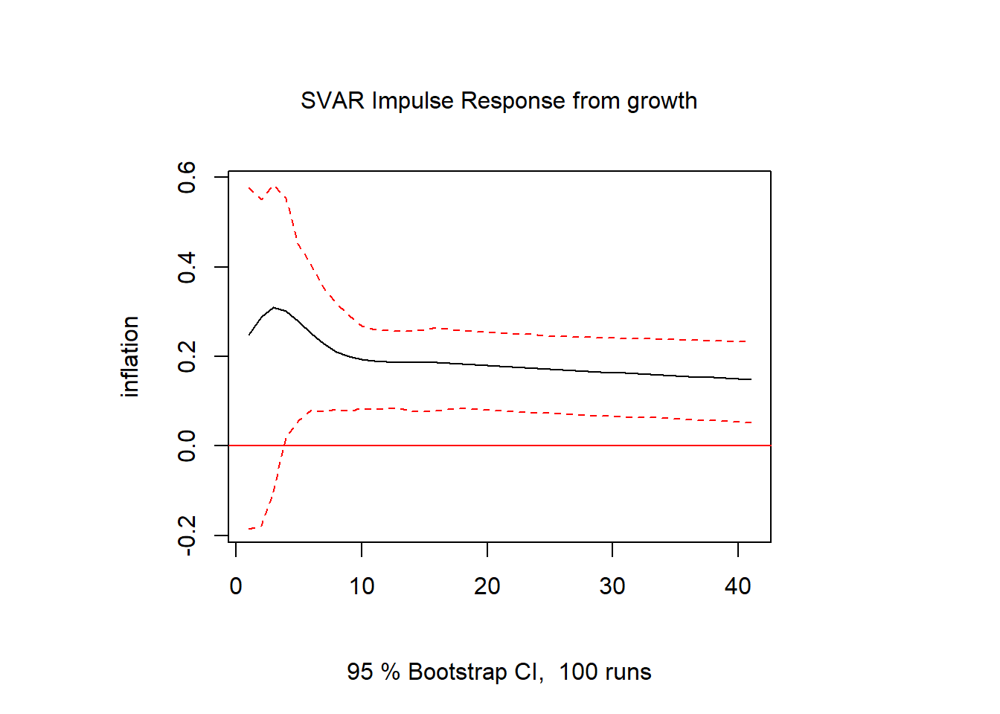

```r
#FEVD
vd = fevd(svar1, n.ahead=40)
plot(vd)
```


## ARDL

```r
library(ARDL)
#> Warning: package 'ARDL' was built under R version 4.2.3
#> To cite the ARDL package in publications:
#> 
#> Use this reference to refer to the validity of the
#> ARDL package.
#> 
#>   Natsiopoulos, Kleanthis, and Tzeremes, Nickolaos G.
#>   (2022). ARDL bounds test for cointegration:
#>   Replicating the Pesaran et al. (2001) results for
#>   the UK earnings equation using R. Journal of
#>   Applied Econometrics, 37(5), 1079-1090.
#>   https://doi.org/10.1002/jae.2919
#> 
#> Use this reference to cite this specific version of
#> the ARDL package.
#> 
#>   Kleanthis Natsiopoulos and Nickolaos Tzeremes
#>   (2023). ARDL: ARDL, ECM and Bounds-Test for
#>   Cointegration. R package version 0.2.4.
#>   https://CRAN.R-project.org/package=ARDL
# data sample
data(denmark)
denmark <- data.frame(denmark)
attach(denmark)
str(denmark)
#> 'data.frame':	55 obs. of  5 variables:
#>  $ LRM: num  11.6 11.6 11.6 11.6 11.6 ...
#>  $ LRY: num  5.9 5.87 5.84 5.81 5.8 ...
#>  $ LPY: num  -0.619 -0.581 -0.543 -0.505 -0.486 ...
#>  $ IBO: num  0.155 0.178 0.171 0.152 0.134 ...
#>  $ IDE: num  0.094 0.0955 0.0955 0.0955 0.0885 0.079 0.076 0.074 0.072 0.078 ...
```


```r
denmark = ts(denmark, start=c(1974,1), frequency=12)
plot(denmark)
```

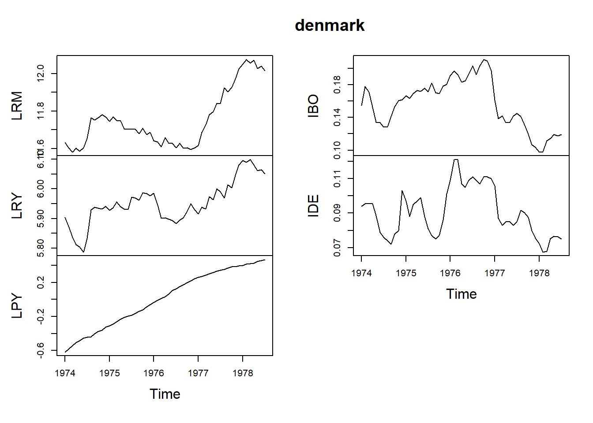


```r
library(tseries)
#> Warning: package 'tseries' was built under R version 4.2.3
#> Registered S3 method overwritten by 'quantmod':
#>   method            from
#>   as.zoo.data.frame zoo
#> 
#> Attaching package: 'tseries'
#> The following objects are masked from 'package:aTSA':
#> 
#>     adf.test, kpss.test, pp.test
pp.test(LRM) #Non-Stationary
#> 
#> 	Phillips-Perron Unit Root Test
#> 
#> data:  LRM
#> Dickey-Fuller Z(alpha) = -3.2568, Truncation lag
#> parameter = 3, p-value = 0.9205
#> alternative hypothesis: stationary
pp.test(LRY) #Non-Stationary
#> 
#> 	Phillips-Perron Unit Root Test
#> 
#> data:  LRY
#> Dickey-Fuller Z(alpha) = -11.467, Truncation lag
#> parameter = 3, p-value = 0.428
#> alternative hypothesis: stationary
pp.test(IBO) #Non-Stationary
#> 
#> 	Phillips-Perron Unit Root Test
#> 
#> data:  IBO
#> Dickey-Fuller Z(alpha) = -5.5494, Truncation lag
#> parameter = 3, p-value = 0.7882
#> alternative hypothesis: stationary
pp.test(IDE) #Non-Stationary
#> 
#> 	Phillips-Perron Unit Root Test
#> 
#> data:  IDE
#> Dickey-Fuller Z(alpha) = -9.0346, Truncation lag
#> parameter = 3, p-value = 0.5761
#> alternative hypothesis: stationary
pp.test(diff(LRM)) #Stationary
#> Warning in pp.test(diff(LRM)): p-value smaller than printed
#> p-value
#> 
#> 	Phillips-Perron Unit Root Test
#> 
#> data:  diff(LRM)
#> Dickey-Fuller Z(alpha) = -59.819, Truncation lag
#> parameter = 3, p-value = 0.01
#> alternative hypothesis: stationary
pp.test(diff(LRY)) #Stationary
#> Warning in pp.test(diff(LRY)): p-value smaller than printed
#> p-value
#> 
#> 	Phillips-Perron Unit Root Test
#> 
#> data:  diff(LRY)
#> Dickey-Fuller Z(alpha) = -42.472, Truncation lag
#> parameter = 3, p-value = 0.01
#> alternative hypothesis: stationary
pp.test(diff(IBO)) #Stationary
#> Warning in pp.test(diff(IBO)): p-value smaller than printed
#> p-value
#> 
#> 	Phillips-Perron Unit Root Test
#> 
#> data:  diff(IBO)
#> Dickey-Fuller Z(alpha) = -38.898, Truncation lag
#> parameter = 3, p-value = 0.01
#> alternative hypothesis: stationary
pp.test(diff(IDE)) #Stationary
#> Warning in pp.test(diff(IDE)): p-value smaller than printed
#> p-value
#> 
#> 	Phillips-Perron Unit Root Test
#> 
#> data:  diff(IDE)
#> Dickey-Fuller Z(alpha) = -35.668, Truncation lag
#> parameter = 3, p-value = 0.01
#> alternative hypothesis: stationary
```

```r
# ARDL Auto Search Optimum Lag
models <- auto_ardl(LRM ~ LRY + IBO + IDE, data = denmark, max_order = 5)
# The top 20 models according to the AIC
models$top_orders
#>    LRM LRY IBO IDE       AIC
#> 1    3   1   3   2 -251.0259
#> 2    3   1   3   3 -250.1144
#> 3    2   2   0   0 -249.6266
#> 4    3   2   3   2 -249.1087
#> 5    3   2   3   3 -248.1858
#> 6    2   2   0   1 -247.7786
#> 7    2   1   0   0 -247.5643
#> 8    2   2   1   1 -246.6885
#> 9    3   3   3   3 -246.3061
#> 10   2   2   1   2 -246.2709
#> 11   2   1   1   1 -245.8736
#> 12   2   2   2   2 -245.7722
#> 13   1   1   0   0 -245.6620
#> 14   2   1   2   2 -245.1712
#> 15   3   1   2   2 -245.0996
#> 16   1   0   0   0 -244.4317
#> 17   1   1   0   1 -243.7702
#> 18   5   5   5   5 -243.3120
#> 19   4   1   3   2 -243.0728
#> 20   4   1   3   3 -242.4378
```


```r
# The best model was found to be the ARDL(3,1,3,2)
ardl_3132 <- models$best_model
ardl_3132$order
#> LRM LRY IBO IDE 
#>   3   1   3   2
```


```r
summary(ardl_3132)
#> 
#> Time series regression with "ts" data:
#> Start = 1974(4), End = 1978(7)
#> 
#> Call:
#> dynlm::dynlm(formula = full_formula, data = data, start = start, 
#>     end = end)
#> 
#> Residuals:
#>       Min        1Q    Median        3Q       Max 
#> -0.029939 -0.008856 -0.002562  0.008190  0.072577 
#> 
#> Coefficients:
#>             Estimate Std. Error t value Pr(>|t|)    
#> (Intercept)   2.6202     0.5678   4.615 4.19e-05 ***
#> L(LRM, 1)     0.3192     0.1367   2.336 0.024735 *  
#> L(LRM, 2)     0.5326     0.1324   4.024 0.000255 ***
#> L(LRM, 3)    -0.2687     0.1021  -2.631 0.012143 *  
#> LRY           0.6728     0.1312   5.129 8.32e-06 ***
#> L(LRY, 1)    -0.2574     0.1472  -1.749 0.088146 .  
#> IBO          -1.0785     0.3217  -3.353 0.001790 ** 
#> L(IBO, 1)    -0.1062     0.5858  -0.181 0.857081    
#> L(IBO, 2)     0.2877     0.5691   0.505 0.616067    
#> L(IBO, 3)    -0.9947     0.3925  -2.534 0.015401 *  
#> IDE           0.1255     0.5545   0.226 0.822161    
#> L(IDE, 1)    -0.3280     0.7213  -0.455 0.651847    
#> L(IDE, 2)     1.4079     0.5520   2.550 0.014803 *  
#> ---
#> Signif. codes:  
#> 0 '***' 0.001 '**' 0.01 '*' 0.05 '.' 0.1 ' ' 1
#> 
#> Residual standard error: 0.0191 on 39 degrees of freedom
#> Multiple R-squared:  0.988,	Adjusted R-squared:  0.9843 
#> F-statistic: 266.8 on 12 and 39 DF,  p-value: < 2.2e-16
```


```r
library(lmtest)
bgtest(ardl_3132) # Autocorrelation Test
#> 
#> 	Breusch-Godfrey test for serial correlation of order
#> 	up to 1
#> 
#> data:  ardl_3132
#> LM test = 1.1192, df = 1, p-value = 0.2901
bptest(ardl_3132) # Heteroscedasticity Test
#> 
#> 	studentized Breusch-Pagan test
#> 
#> data:  ardl_3132
#> BP = 4.4815, df = 12, p-value = 0.9731
```


```r
# Cointegration Test
fbounds <- bounds_f_test(ardl_3132, case = 2, alpha = 0.05)
fbounds$tab
#>   statistic Lower-bound I(0) Upper-bound I(1) alpha
#> F  5.116768          2.77498          3.65953  0.05
#>       p.value
#> F 0.004417563
```


```r
# ARDL-ECM
uecm_3132 <- uecm(LRM ~ LRY + IBO + IDE, data = denmark, order = c(3,1,3,2))
summary(uecm_3132)
#> 
#> Time series regression with "ts" data:
#> Start = 1974(4), End = 1978(7)
#> 
#> Call:
#> dynlm::dynlm(formula = full_formula, data = data, start = start, 
#>     end = end)
#> 
#> Residuals:
#>       Min        1Q    Median        3Q       Max 
#> -0.029939 -0.008856 -0.002562  0.008190  0.072577 
#> 
#> Coefficients:
#>              Estimate Std. Error t value Pr(>|t|)    
#> (Intercept)   2.62019    0.56777   4.615 4.19e-05 ***
#> L(LRM, 1)    -0.41685    0.09166  -4.548 5.15e-05 ***
#> L(LRY, 1)     0.41538    0.11761   3.532  0.00108 ** 
#> L(IBO, 1)    -1.89172    0.39111  -4.837 2.09e-05 ***
#> L(IDE, 1)     1.20534    0.44690   2.697  0.01028 *  
#> d(L(LRM, 1)) -0.26394    0.10192  -2.590  0.01343 *  
#> d(L(LRM, 2))  0.26867    0.10213   2.631  0.01214 *  
#> d(LRY)        0.67280    0.13116   5.129 8.32e-06 ***
#> d(IBO)       -1.07852    0.32170  -3.353  0.00179 ** 
#> d(L(IBO, 1))  0.70701    0.46874   1.508  0.13953    
#> d(L(IBO, 2))  0.99468    0.39251   2.534  0.01540 *  
#> d(IDE)        0.12546    0.55445   0.226  0.82216    
#> d(L(IDE, 1)) -1.40786    0.55204  -2.550  0.01480 *  
#> ---
#> Signif. codes:  
#> 0 '***' 0.001 '**' 0.01 '*' 0.05 '.' 0.1 ' ' 1
#> 
#> Residual standard error: 0.0191 on 39 degrees of freedom
#> Multiple R-squared:  0.7458,	Adjusted R-squared:  0.6676 
#> F-statistic: 9.537 on 12 and 39 DF,  p-value: 3.001e-08
```


```r
# ARDL-ECM 2
recm_3132 <- recm(uecm_3132, case = 2)
summary(recm_3132)
#> 
#> Time series regression with "zooreg" data:
#> Start = Apr 1974, End = Jul 1978
#> 
#> Call:
#> dynlm::dynlm(formula = full_formula, data = data, start = start, 
#>     end = end)
#> 
#> Residuals:
#>       Min        1Q    Median        3Q       Max 
#> -0.029939 -0.008856 -0.002562  0.008190  0.072577 
#> 
#> Coefficients:
#>              Estimate Std. Error t value Pr(>|t|)    
#> d(L(LRM, 1)) -0.26394    0.09008  -2.930 0.005405 ** 
#> d(L(LRM, 2))  0.26867    0.09127   2.944 0.005214 ** 
#> d(LRY)        0.67280    0.11591   5.805 7.03e-07 ***
#> d(IBO)       -1.07852    0.30025  -3.592 0.000837 ***
#> d(L(IBO, 1))  0.70701    0.44359   1.594 0.118300    
#> d(L(IBO, 2))  0.99468    0.36491   2.726 0.009242 ** 
#> d(IDE)        0.12546    0.48290   0.260 0.796248    
#> d(L(IDE, 1)) -1.40786    0.48867  -2.881 0.006160 ** 
#> ect          -0.41685    0.07849  -5.311 3.63e-06 ***
#> ---
#> Signif. codes:  
#> 0 '***' 0.001 '**' 0.01 '*' 0.05 '.' 0.1 ' ' 1
#> 
#> Residual standard error: 0.01819 on 43 degrees of freedom
#>   (0 observations deleted due to missingness)
#> Multiple R-squared:  0.7613,	Adjusted R-squared:  0.7113 
#> F-statistic: 15.24 on 9 and 43 DF,  p-value: 9.545e-11
```


```r
# Short Run Coefficients
multipliers(ardl_3132, type = "sr")
#>          Term   Estimate Std. Error    t value     Pr(>|t|)
#> 1 (Intercept)  2.6201916  0.5677679  4.6148990 4.186867e-05
#> 2         LRY  0.6727993  0.1311638  5.1294603 8.317401e-06
#> 3         IBO -1.0785180  0.3217011 -3.3525465 1.790030e-03
#> 4         IDE  0.1254643  0.5544522  0.2262852 8.221614e-01
```


```r
# Long Run Coefficients
multipliers(ardl_3132, type = "lr")
#>          Term   Estimate Std. Error   t value     Pr(>|t|)
#> 1 (Intercept)  6.2856579  0.7719160  8.142930 6.107445e-10
#> 2         LRY  0.9964676  0.1239310  8.040503 8.358472e-10
#> 3         IBO -4.5381160  0.5202961 -8.722180 1.058619e-10
#> 4         IDE  2.8915201  0.9950853  2.905801 6.009239e-03
```


```r
library(lmtest) # for resettest()
library(strucchange) # for efp(), and sctest()
resettest(uecm_3132, type = c("regressor"))
#> 
#> 	RESET test
#> 
#> data:  uecm_3132
#> RESET = 1.2408, df1 = 24, df2 = 15, p-value = 0.3383
```


```r
# Stability
uecm_3132_lm_names <- to_lm(uecm_3132, fix_names = TRUE)
fluctuation <- efp(uecm_3132_lm_names$full_formula, 
                   data = uecm_3132_lm_names$model)
plot(fluctuation)
```

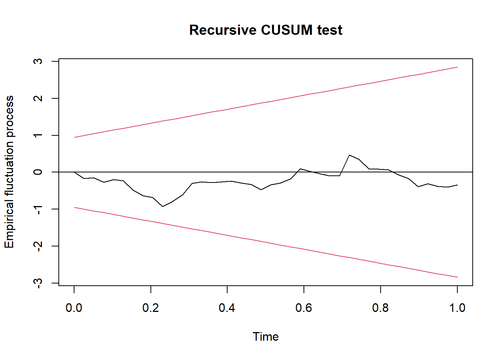


