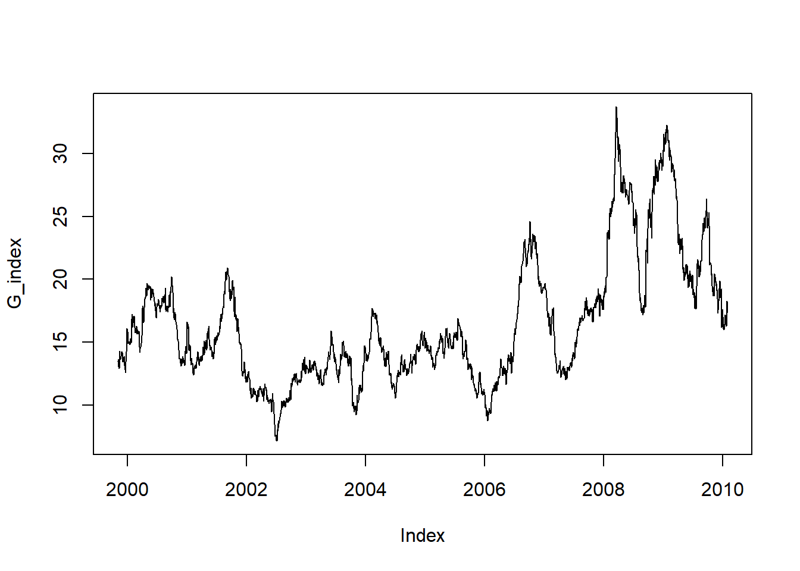
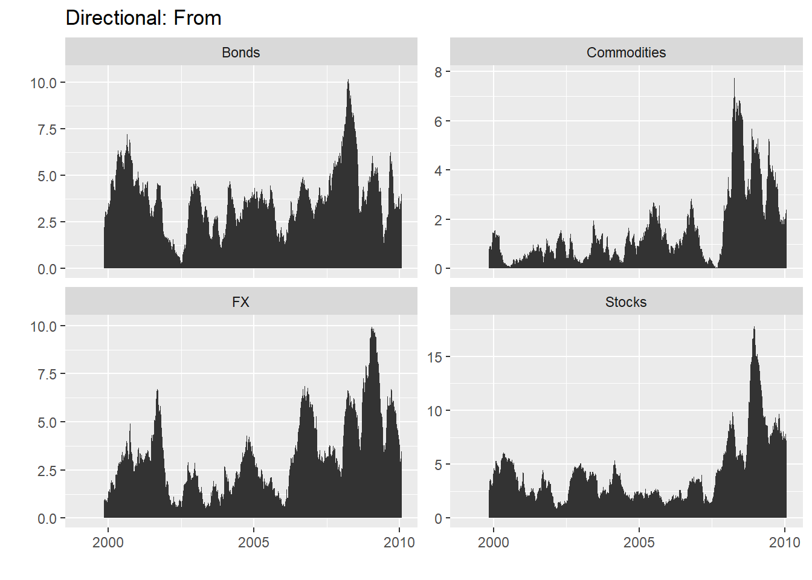
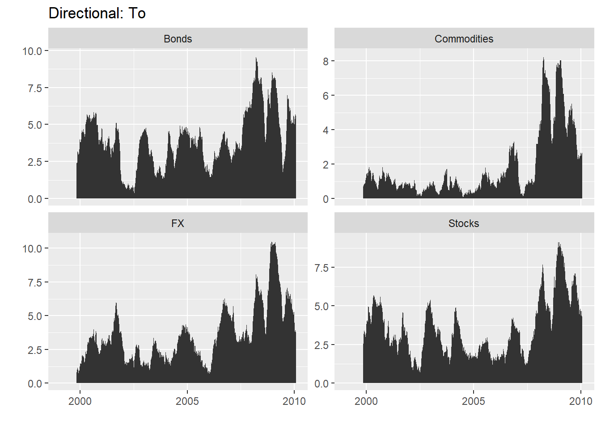
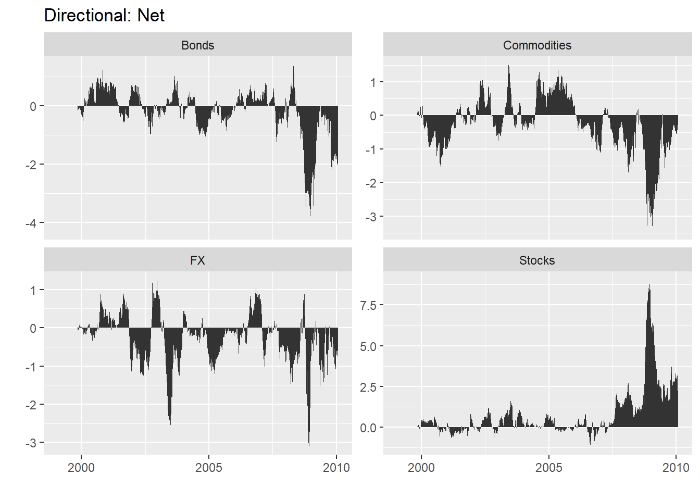
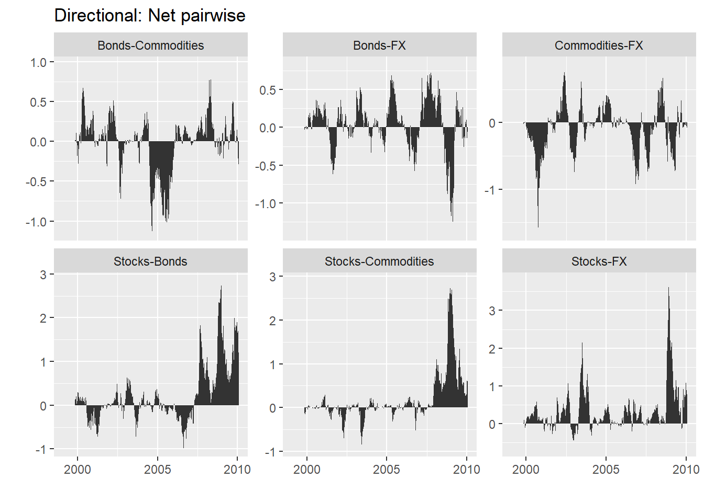
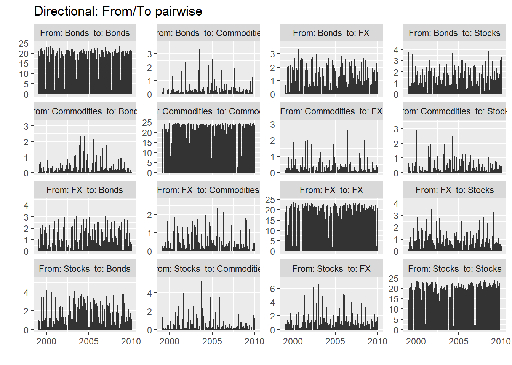
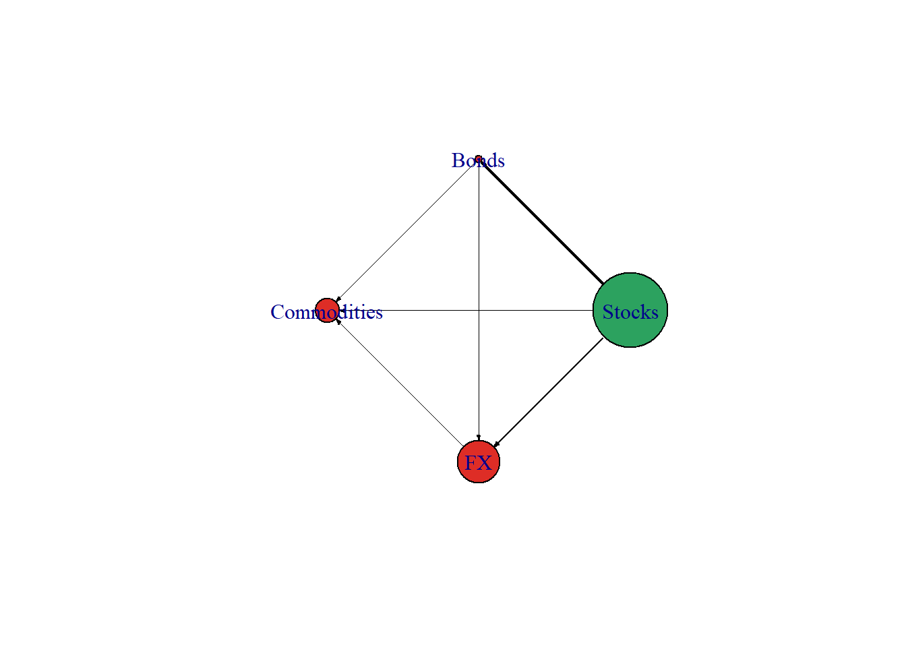

# Time Series Spillover - GVAR
## Library

```r
library(Spillover)
#> Loading required package: vars
#> Loading required package: MASS
#> Loading required package: strucchange
#> Loading required package: zoo
#> 
#> Attaching package: 'zoo'
#> The following objects are masked from 'package:base':
#> 
#>     as.Date, as.Date.numeric
#> Loading required package: sandwich
#> Loading required package: urca
#> Loading required package: lmtest
library(vars)
library(urca)
library(splitstackshape)
library(igraph)
#> 
#> Attaching package: 'igraph'
#> The following objects are masked from 'package:stats':
#> 
#>     decompose, spectrum
#> The following object is masked from 'package:base':
#> 
#>     union
library(reshape)
```

## Data: Diebold-Yilmaz 2012


```r
data(dy2012)
head(dy2012)  # in log volatility form
#>         Date     Stocks      Bonds Commodities         FX
#> 1 1999-01-25  -9.891998 -10.081905   -9.797694 -12.971578
#> 2 1999-01-26  -9.353294 -10.090498  -11.475212 -13.237477
#> 3 1999-01-27  -9.314619 -10.103319  -15.317140  -9.749465
#> 4 1999-01-28  -8.997370 -10.090498  -12.044040 -10.853610
#> 5 1999-01-29  -8.855955  -9.426092  -12.928477 -11.788281
#> 6 1999-02-01 -10.282395  -8.936206  -12.821930 -11.308455
```

**log volatility return:** 
$$
\sigma^2_{it} = 0.361[ln(P^{max}_{i,t}) - ln(P^{min}_{i,t-1}))]^2
$$

$$
\sigma_{it} = 100*(\sqrt{252*\sigma^2_{it}})
$$


```r
class(dy2012)
#> [1] "data.frame"
```


```r
nrow(dy2012)
#> [1] 2771
```

## VAR Model


```r
PP.test(dy2012$Stocks)
#> 
#> 	Phillips-Perron Unit Root Test
#> 
#> data:  dy2012$Stocks
#> Dickey-Fuller = -32.546, Truncation lag parameter =
#> 9, p-value = 0.01
PP.test(dy2012$Bonds)
#> 
#> 	Phillips-Perron Unit Root Test
#> 
#> data:  dy2012$Bonds
#> Dickey-Fuller = -41.249, Truncation lag parameter =
#> 9, p-value = 0.01
PP.test(dy2012$Commodities)
#> 
#> 	Phillips-Perron Unit Root Test
#> 
#> data:  dy2012$Commodities
#> Dickey-Fuller = -48.523, Truncation lag parameter =
#> 9, p-value = 0.01
PP.test(dy2012$FX)
#> 
#> 	Phillips-Perron Unit Root Test
#> 
#> data:  dy2012$FX
#> Dickey-Fuller = -47.527, Truncation lag parameter =
#> 9, p-value = 0.01
```


```r
# Optimum Lag
VARselect(dy2012[,-1], lag.max = 4, type = c("both"))
#> $selection
#> AIC(n)  HQ(n)  SC(n) FPE(n) 
#>      4      4      4      4 
#> 
#> $criteria
#>                  1          2          3          4
#> AIC(n) -0.11329876 -0.4490460 -0.5882320 -0.6679637
#> HQ(n)  -0.09473562 -0.4181074 -0.5449180 -0.6122743
#> SC(n)  -0.06190286 -0.3633861 -0.4683083 -0.5137760
#> FPE(n)  0.89288389  0.6382368  0.5553084  0.5127520
```


```r
# VAR Model
VAR_4 <- VAR(dy2012[,-1], p=4)
VAR_4
#> 
#> VAR Estimation Results:
#> ======================= 
#> 
#> Estimated coefficients for equation Stocks: 
#> =========================================== 
#> Call:
#> Stocks = Stocks.l1 + Bonds.l1 + Commodities.l1 + FX.l1 + Stocks.l2 + Bonds.l2 + Commodities.l2 + FX.l2 + Stocks.l3 + Bonds.l3 + Commodities.l3 + FX.l3 + Stocks.l4 + Bonds.l4 + Commodities.l4 + FX.l4 + const 
#> 
#>      Stocks.l1       Bonds.l1 Commodities.l1          FX.l1 
#>   0.1835084630  -0.0242487169  -0.0036337209   0.0219988664 
#>      Stocks.l2       Bonds.l2 Commodities.l2          FX.l2 
#>   0.2741423171   0.0027926328  -0.0108044031   0.0040316592 
#>      Stocks.l3       Bonds.l3 Commodities.l3          FX.l3 
#>   0.2025153665   0.0360740337  -0.0158017651   0.0007938866 
#>      Stocks.l4       Bonds.l4 Commodities.l4          FX.l4 
#>   0.1620506569   0.0333733392  -0.0029608791  -0.0007384703 
#>          const 
#>  -1.3401330918 
#> 
#> 
#> Estimated coefficients for equation Bonds: 
#> ========================================== 
#> Call:
#> Bonds = Stocks.l1 + Bonds.l1 + Commodities.l1 + FX.l1 + Stocks.l2 + Bonds.l2 + Commodities.l2 + FX.l2 + Stocks.l3 + Bonds.l3 + Commodities.l3 + FX.l3 + Stocks.l4 + Bonds.l4 + Commodities.l4 + FX.l4 + const 
#> 
#>      Stocks.l1       Bonds.l1 Commodities.l1          FX.l1 
#>    0.068141170    0.163772247    0.052592815    0.004319034 
#>      Stocks.l2       Bonds.l2 Commodities.l2          FX.l2 
#>    0.025511120    0.174716290    0.024936542    0.013962476 
#>      Stocks.l3       Bonds.l3 Commodities.l3          FX.l3 
#>    0.041353468    0.129894730   -0.043136698    0.011844827 
#>      Stocks.l4       Bonds.l4 Commodities.l4          FX.l4 
#>   -0.026075514    0.218597337    0.039128430   -0.027491905 
#>          const 
#>   -1.080792116 
#> 
#> 
#> Estimated coefficients for equation Commodities: 
#> ================================================ 
#> Call:
#> Commodities = Stocks.l1 + Bonds.l1 + Commodities.l1 + FX.l1 + Stocks.l2 + Bonds.l2 + Commodities.l2 + FX.l2 + Stocks.l3 + Bonds.l3 + Commodities.l3 + FX.l3 + Stocks.l4 + Bonds.l4 + Commodities.l4 + FX.l4 + const 
#> 
#>      Stocks.l1       Bonds.l1 Commodities.l1          FX.l1 
#>   -0.022755735    0.098201350    0.183333080    0.048298645 
#>      Stocks.l2       Bonds.l2 Commodities.l2          FX.l2 
#>   -0.013291588   -0.013132921    0.207410140    0.044188995 
#>      Stocks.l3       Bonds.l3 Commodities.l3          FX.l3 
#>   -0.049827512    0.004592325    0.185198136   -0.037523992 
#>      Stocks.l4       Bonds.l4 Commodities.l4          FX.l4 
#>   -0.030251601    0.060251069    0.156050483    0.038706445 
#>          const 
#>   -1.543777242 
#> 
#> 
#> Estimated coefficients for equation FX: 
#> ======================================= 
#> Call:
#> FX = Stocks.l1 + Bonds.l1 + Commodities.l1 + FX.l1 + Stocks.l2 + Bonds.l2 + Commodities.l2 + FX.l2 + Stocks.l3 + Bonds.l3 + Commodities.l3 + FX.l3 + Stocks.l4 + Bonds.l4 + Commodities.l4 + FX.l4 + const 
#> 
#>      Stocks.l1       Bonds.l1 Commodities.l1          FX.l1 
#>     0.06467245    -0.01930672     0.02517504     0.06996402 
#>      Stocks.l2       Bonds.l2 Commodities.l2          FX.l2 
#>     0.03590206    -0.02073267     0.01066279     0.20847309 
#>      Stocks.l3       Bonds.l3 Commodities.l3          FX.l3 
#>    -0.01249224     0.03780188    -0.00393800     0.18185464 
#>      Stocks.l4       Bonds.l4 Commodities.l4          FX.l4 
#>    -0.01552454     0.05072537     0.01667104     0.11443511 
#>          const 
#>    -2.99838336
```

## Volatility Spillover DY-2012


```r
# Total Spillover Index
sp <- G.spillover(VAR_4, n.ahead = 10, standardized = F )
sp
#>                                Stocks     Bonds Commodities
#> Stocks                      88.757002  7.291185   0.3453279
#> Bonds                       10.213545 81.445712   2.7269737
#> Commodities                  0.468118  3.695953  93.6941893
#> FX                           5.691579  7.026017   1.5477592
#> C. to others (spillover)    16.373241 18.013154   4.6200608
#> C. to others including own 105.130243 99.458866  98.3142500
#>                                   FX C. from others
#> Stocks                      3.606486      11.242998
#> Bonds                       5.613770      18.554288
#> Commodities                 2.141740       6.305811
#> FX                         85.734645      14.265355
#> C. to others (spillover)   11.361996      12.592113
#> C. to others including own 97.096641     400.000000
```

The total volatility spillover appears in the lower right corner of Table, which indicates that, on average, across our entire sample, 12.6% of the volatility forecast error variance in all four markets comes from spillovers


```r
Spillover::net(sp)
#> Warning: 'Spillover::net' is deprecated.
#> Use 'dynamic.spillover' instead.
#> See help("Deprecated")
#>                    To      From        Net Transmitter
#> Stocks      16.373241 11.242998  5.1302430        TRUE
#> Bonds       18.013154 18.554288 -0.5411342       FALSE
#> Commodities  4.620061  6.305811 -1.6857500       FALSE
#> FX          11.361996 14.265355 -2.9033588       FALSE
```

## Dynamic Spillover Index / rolling-sample total volatility spillover


```r
# Data Setting
data(dy2012)
dy2012$Date <- as.Date(dy2012$Date, "%Y-%m-%d")
dy2012 <- as.zoo(dy2012[,-1], order.by = dy2012$Date)
class(dy2012)
#> [1] "zoo"
```


```r
# Generalized rolling spillover index based on a VAR(4)
G_index<- total.dynamic.spillover(dy2012, width = 200, index="generalized", p=4) 
head(G_index, n=10)
#> 1999-11-05 1999-11-08 1999-11-09 1999-11-10 1999-11-11 
#>   13.50622   13.60646   13.16968   13.04980   12.95939 
#> 1999-11-12 1999-11-15 1999-11-16 1999-11-17 1999-11-18 
#>   12.92011   14.27211   14.04579   13.90963   13.85581
```


```r
plot(G_index)
```



## Directional volatility spillovers


```r
library(zoo)
data(dy2012) # re-import data
class(dy2012)
#> [1] "data.frame"
```


```r
dy_results <- dynamic.spillover(dy2012, width=200, remove.own = FALSE)
str(dy_results)
#> List of 5
#>  $ from            :'data.frame':	2771 obs. of  5 variables:
#>   ..$ Date       : Factor w/ 2771 levels "1999-01-25","1999-01-26",..: 1 2 3 4 5 6 7 8 9 10 ...
#>   ..$ Stocks     : num [1:2771] 0 0 0 0 0 0 0 0 0 0 ...
#>   ..$ Bonds      : num [1:2771] 0 0 0 0 0 0 0 0 0 0 ...
#>   ..$ Commodities: num [1:2771] 0 0 0 0 0 0 0 0 0 0 ...
#>   ..$ FX         : num [1:2771] 0 0 0 0 0 0 0 0 0 0 ...
#>  $ to              :'data.frame':	2771 obs. of  5 variables:
#>   ..$ Date       : Factor w/ 2771 levels "1999-01-25","1999-01-26",..: 1 2 3 4 5 6 7 8 9 10 ...
#>   ..$ Stocks     : num [1:2771] 0 0 0 0 0 0 0 0 0 0 ...
#>   ..$ Bonds      : num [1:2771] 0 0 0 0 0 0 0 0 0 0 ...
#>   ..$ Commodities: num [1:2771] 0 0 0 0 0 0 0 0 0 0 ...
#>   ..$ FX         : num [1:2771] 0 0 0 0 0 0 0 0 0 0 ...
#>  $ net             :'data.frame':	2771 obs. of  5 variables:
#>   ..$ Date       : Factor w/ 2771 levels "1999-01-25","1999-01-26",..: 1 2 3 4 5 6 7 8 9 10 ...
#>   ..$ Stocks     : num [1:2771] 0 0 0 0 0 0 0 0 0 0 ...
#>   ..$ Bonds      : num [1:2771] 0 0 0 0 0 0 0 0 0 0 ...
#>   ..$ Commodities: num [1:2771] 0 0 0 0 0 0 0 0 0 0 ...
#>   ..$ FX         : num [1:2771] 0 0 0 0 0 0 0 0 0 0 ...
#>  $ net_pairwise    :'data.frame':	2771 obs. of  7 variables:
#>   ..$ Date              : Factor w/ 2771 levels "1999-01-25","1999-01-26",..: 1 2 3 4 5 6 7 8 9 10 ...
#>   ..$ Stocks-Bonds      : num [1:2771] 0 0 0 0 0 0 0 0 0 0 ...
#>   ..$ Stocks-Commodities: num [1:2771] 0 0 0 0 0 0 0 0 0 0 ...
#>   ..$ Stocks-FX         : num [1:2771] 0 0 0 0 0 0 0 0 0 0 ...
#>   ..$ Bonds-Commodities : num [1:2771] 0 0 0 0 0 0 0 0 0 0 ...
#>   ..$ Bonds-FX          : num [1:2771] 0 0 0 0 0 0 0 0 0 0 ...
#>   ..$ Commodities-FX    : num [1:2771] 0 0 0 0 0 0 0 0 0 0 ...
#>  $ from_to_pairwise:'data.frame':	44336 obs. of  3 variables:
#>   ..$ Date     : Factor w/ 2771 levels "1999-01-25","1999-01-26",..: 1 2 3 4 5 6 7 8 9 10 ...
#>   ..$ variables: chr [1:44336] "From: Stocks  to: Stocks" "From: Stocks  to: Bonds" "From: Stocks  to: Commodities" "From: Stocks  to: FX" ...
#>   ..$ value    : num [1:44336] 0 0 0 0 0 0 0 0 0 0 ...
#>  - attr(*, "class")= chr "directional.spillover"
```


```r
# Directional volatility spillovers, FROM four asset classes.
pp_from <- plotdy(dy_results, direction = "from")
```




```r
# Directional volatility spillovers, TO four asset classes.
pp_to <- plotdy(dy_results, direction = "to")
```




```r
# Net volatility spillovers, four asset classes
pp_net <- plotdy(dy_results, direction = "net")
```




```r
# Net pairwise volatility spillovers
pp_netpairwise <- plotdy(dy_results, direction = "net_pairwise")
```




```r
pp_from_to_pairwise <- plotdy(dy_results, direction = "from_to_pairwise")
```



## Connectedness Network


```r
sp <- G.spillover(VAR_4, n.ahead = 10, standardized = F )
datanet <-  Spillover::net(sp)
#> Warning: 'Spillover::net' is deprecated.
#> Use 'dynamic.spillover' instead.
#> See help("Deprecated")
datanet
#>                    To      From        Net Transmitter
#> Stocks      16.373241 11.242998  5.1302430        TRUE
#> Bonds       18.013154 18.554288 -0.5411342       FALSE
#> Commodities  4.620061  6.305811 -1.6857500       FALSE
#> FX          11.361996 14.265355 -2.9033588       FALSE
```


```r
# Data frame node
node_df <- data.frame(rownames(datanet), rownames(datanet),datanet$Net)
names(node_df) <- c("id","label","size")
head(node_df)
#>            id       label       size
#> 1      Stocks      Stocks  5.1302430
#> 2       Bonds       Bonds -0.5411342
#> 3 Commodities Commodities -1.6857500
#> 4          FX          FX -2.9033588
```


```r
sp <- sp[1:4,1:4]
sp
#>                Stocks     Bonds Commodities        FX
#> Stocks      88.757002  7.291185   0.3453279  3.606486
#> Bonds       10.213545 81.445712   2.7269737  5.613770
#> Commodities  0.468118  3.695953  93.6941893  2.141740
#> FX           5.691579  7.026017   1.5477592 85.734645
```


```r
# Data frame edge
m1 <- melt(sp)[melt(upper.tri(sp))$value,] # FROM
m2 <- melt(sp)[melt(lower.tri(sp))$value,] # TO
m1 <- m1[order(m1$X1),]
m2 <- m2[order(m2$X2),]
```


```r
edge_df <- data.frame("to"=m1[,2],"from"=m1[,1], "weight" = m1$value-m2$value)
library(dplyr)
#> Warning: package 'dplyr' was built under R version 4.2.3
#> 
#> Attaching package: 'dplyr'
#> The following object is masked from 'package:reshape':
#> 
#>     rename
#> The following objects are masked from 'package:igraph':
#> 
#>     as_data_frame, groups, union
#> The following object is masked from 'package:MASS':
#> 
#>     select
#> The following objects are masked from 'package:stats':
#> 
#>     filter, lag
#> The following objects are masked from 'package:base':
#> 
#>     intersect, setdiff, setequal, union
edge_df_positive <- edge_df %>% filter(weight >= 0)
edge_df_negative <- edge_df %>% filter(weight < 0)

edge_df_negative <- edge_df_negative %>%
  mutate(weight = -weight) %>%
  dplyr::rename(to = from, from = to)
edge_df <- bind_rows(edge_df_positive, edge_df_negative)
```


```r
positive_weight <- edge_df$weight[edge_df$weight > 0]
negative_weight <- edge_df$weight[edge_df$weight < 0]
positive_size <- node_df$size[node_df$size > 0]
negative_size <- node_df$size[node_df$size < 0]

library(RColorBrewer)
Transmitter_color <- "#2ca25f"
else_color <- "#de2d26"
color_vec1 <- ifelse(edge_df$weight > 0, Transmitter_color, else_color)
color_vec2 <- ifelse(node_df$size > 0, Transmitter_color, else_color)
```


```r
graph <- graph_from_data_frame(edge_df, directed = TRUE, vertices = node_df)
E(graph)$color <- "black" # Egde
V(graph)$color <- color_vec2 # Node
E(graph)$weight <- abs(edge_df$weight)
V(graph)$size <- abs(node_df$size)
```


```r
E(graph)$weight <- E(graph)$weight / max(E(graph)$weight) * 2
V(graph)$size <- V(graph)$size / max(V(graph)$size) * 50
```


```r
plot(graph, edge.width = E(graph)$weight, layout=layout_in_circle(graph), edge.arrow.mode=2, edge.arrow.size=0.2)
```


