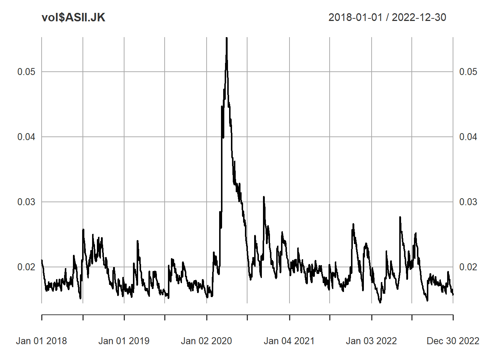
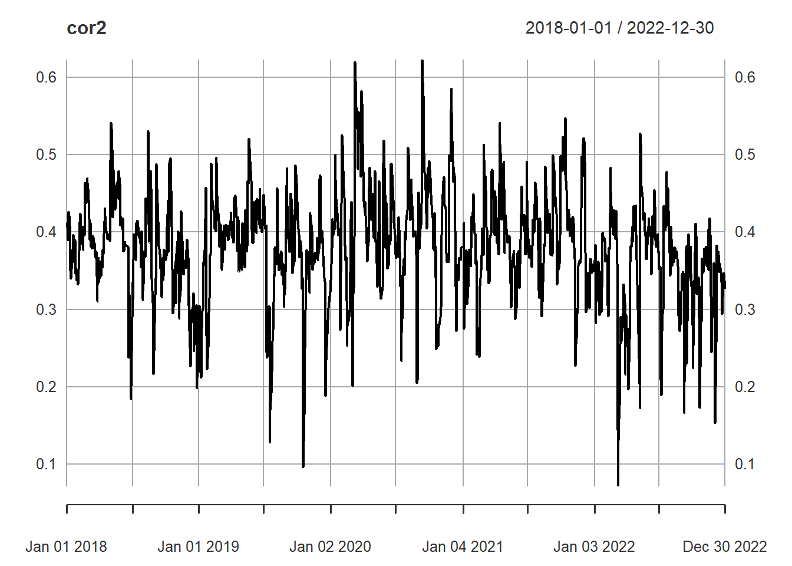

# Multivariate GARCH

## DCC-GARCH


```r
library(quantmod)
#> Warning: package 'quantmod' was built under R version 4.2.3
#> Loading required package: xts
#> Warning: package 'xts' was built under R version 4.2.3
#> Loading required package: zoo
#> Warning: package 'zoo' was built under R version 4.2.3
#> 
#> Attaching package: 'zoo'
#> The following objects are masked from 'package:base':
#> 
#>     as.Date, as.Date.numeric
#> Loading required package: TTR
#> Warning: package 'TTR' was built under R version 4.2.3
#> Registered S3 method overwritten by 'quantmod':
#>   method            from
#>   as.zoo.data.frame zoo

# Needed Internet Connection !! alike install packages
# Stock Ticker
stocks <- c("ASII.JK","BBCA.JK")

data_list <- lapply(stocks, function(stock) {
    getSymbols(stock, src = "yahoo", from = "2018-01-01", to="2022-12-31", auto.assign = FALSE)
})
#> Warning: ASII.JK contains missing values. Some functions
#> will not work if objects contain missing values in the
#> middle of the series. Consider using na.omit(),
#> na.approx(), na.fill(), etc to remove or replace them.

# Daily Return
returns <- lapply(data_list, function(data) {
    dailyReturn(Cl(data))
})
#> Warning in to_period(xx, period = on.opts[[period]], ...):
#> missing values removed from data

# Combine data
combined_returns <- do.call(merge, returns)
names(combined_returns) <- stocks
combined_returns <- na.omit(combined_returns)
head(combined_returns)
#>                 ASII.JK     BBCA.JK
#> 2018-01-01  0.000000000 0.000000000
#> 2018-01-02 -0.012048193 0.000000000
#> 2018-01-03 -0.018292683 0.000000000
#> 2018-01-04  0.021739130 0.014840183
#> 2018-01-05  0.009118541 0.001124859
#> 2018-01-08  0.000000000 0.004494382
```


```r
library(rugarch)
#> Warning: package 'rugarch' was built under R version 4.2.3
#> Loading required package: parallel
#> 
#> Attaching package: 'rugarch'
#> The following object is masked from 'package:stats':
#> 
#>     sigma
library(rmgarch)
#> Warning: package 'rmgarch' was built under R version 4.2.2
#> 
#> Attaching package: 'rmgarch'
#> The following objects are masked from 'package:xts':
#> 
#>     first, last

# GARCH Specification for a Single Asset
unispec <- ugarchspec(mean.model = list(armaOrder = c(0, 0)),
                     variance.model = list(model = "gjrGARCH",
                                           garchOrder = c(1, 1)),
                     distribution.model = "norm")

# Determine the number of assets
n_assets <- ncol(combined_returns)

# Replicate GARCH Specification for All Assets
garch_spec <- multispec(replicate(n_assets, unispec)) 

# DCC Model Specification
dcc_spec <- dccspec(uspec = garch_spec, 
                   dccOrder = c(1, 1), 
                   distribution = "mvnorm")
```


```r
## Fit DCC
dcc.fit <- dccfit(dcc_spec, 
                 data = combined_returns, 
                 fit.control=list(scale=TRUE))
```


```r
dcc.fit
#> 
#> *---------------------------------*
#> *          DCC GARCH Fit          *
#> *---------------------------------*
#> 
#> Distribution         :  mvnorm
#> Model                :  DCC(1,1)
#> No. Parameters       :  13
#> [VAR GARCH DCC UncQ] : [0+10+2+1]
#> No. Series           :  2
#> No. Obs.             :  1253
#> Log-Likelihood       :  6804.626
#> Av.Log-Likelihood    :  5.43 
#> 
#> Optimal Parameters
#> -----------------------------------
#>                   Estimate  Std. Error   t value Pr(>|t|)
#> [ASII.JK].mu     -0.000439    0.000538  -0.81598 0.414511
#> [ASII.JK].omega   0.000013    0.000001  12.73775 0.000000
#> [ASII.JK].alpha1  0.029271    0.009480   3.08769 0.002017
#> [ASII.JK].beta1   0.912942    0.007720 118.25044 0.000000
#> [ASII.JK].gamma1  0.056569    0.023773   2.37951 0.017336
#> [BBCA.JK].mu      0.000635    0.000531   1.19596 0.231713
#> [BBCA.JK].omega   0.000015    0.000008   1.90305 0.057034
#> [BBCA.JK].alpha1  0.053503    0.030193   1.77204 0.076388
#> [BBCA.JK].beta1   0.820666    0.052706  15.57060 0.000000
#> [BBCA.JK].gamma1  0.127614    0.044277   2.88218 0.003949
#> [Joint]dcca1      0.050241    0.033905   1.48184 0.138382
#> [Joint]dccb1      0.766226    0.197975   3.87032 0.000109
#> 
#> Information Criteria
#> ---------------------
#>                     
#> Akaike       -10.841
#> Bayes        -10.787
#> Shibata      -10.841
#> Hannan-Quinn -10.821
#> 
#> 
#> Elapsed time : 1.267241
```


```r
# Conditional Covariances
cov <- rcov(dcc.fit)
dim(cov)
#> [1]    2    2 1253
cov[,,1:4]
#> , , 2018-01-01
#> 
#>              ASII.JK      BBCA.JK
#> ASII.JK 0.0004465808 0.0001387231
#> BBCA.JK 0.0001387231 0.0002527424
#> 
#> , , 2018-01-02
#> 
#>              ASII.JK      BBCA.JK
#> ASII.JK 0.0004207082 0.0001246004
#> BBCA.JK 0.0001246004 0.0002229686
#> 
#> , , 2018-01-03
#> 
#>              ASII.JK      BBCA.JK
#> ASII.JK 0.0004086507 0.0001138079
#> BBCA.JK 0.0001138079 0.0001985342
#> 
#> , , 2018-01-04
#> 
#>              ASII.JK      BBCA.JK
#> ASII.JK 0.0004134355 0.0001058398
#> BBCA.JK 0.0001058398 0.0001784818
```


```r
# Conditional Volatilities
vol <- sigma(dcc.fit)
head(vol)
#>               ASII.JK    BBCA.JK
#> 2018-01-01 0.02113246 0.01589787
#> 2018-01-02 0.02051117 0.01493213
#> 2018-01-03 0.02021511 0.01409022
#> 2018-01-04 0.02033311 0.01335971
#> 2018-01-05 0.02012066 0.01314336
#> 2018-01-08 0.01962830 0.01254032
```


```r
plot(vol$ASII.JK)
```




```r
plot(vol$BBCA.JK)
```


```r
# Conditional Correlations
cor <- rcor(dcc.fit)
cor[,,1:4]
#> , , 2018-01-01
#> 
#>           ASII.JK   BBCA.JK
#> ASII.JK 1.0000000 0.4129141
#> BBCA.JK 0.4129141 1.0000000
#> 
#> , , 2018-01-02
#> 
#>           ASII.JK   BBCA.JK
#> ASII.JK 1.0000000 0.4068245
#> BBCA.JK 0.4068245 1.0000000
#> 
#> , , 2018-01-03
#> 
#>           ASII.JK   BBCA.JK
#> ASII.JK 1.0000000 0.3995568
#> BBCA.JK 0.3995568 1.0000000
#> 
#> , , 2018-01-04
#> 
#>           ASII.JK   BBCA.JK
#> ASII.JK 1.0000000 0.3896261
#> BBCA.JK 0.3896261 1.0000000
```


```r
date <- row.names(data.frame(cor[1,1,])) 
cor2 <- xts(cor[1, 2, ], order.by = as.Date(date))
plot(cor2)
```




```r
forecast <- dccforecast(dcc.fit, n.ahead = 5)
```


```r
forecast@mforecast$H #Cov
#> [[1]]
#> , , 1
#> 
#>              [,1]         [,2]
#> [1,] 2.400993e-04 5.997349e-05
#> [2,] 5.997349e-05 1.426082e-04
#> 
#> , , 2
#> 
#>              [,1]         [,2]
#> [1,] 2.460159e-04 6.413043e-05
#> [2,] 6.413043e-05 1.492415e-04
#> 
#> , , 3
#> 
#>              [,1]         [,2]
#> [1,] 2.517579e-04 6.792145e-05
#> [2,] 6.792145e-05 1.554634e-04
#> 
#> , , 4
#> 
#>              [,1]         [,2]
#> [1,] 2.573305e-04 7.138252e-05
#> [2,] 7.138252e-05 1.612995e-04
#> 
#> , , 5
#> 
#>              [,1]         [,2]
#> [1,] 2.627387e-04 7.454746e-05
#> [2,] 7.454746e-05 1.667735e-04
```


```r
forecast@mforecast$R #Cor
#> [[1]]
#> , , 1
#> 
#>           [,1]      [,2]
#> [1,] 1.0000000 0.3241094
#> [2,] 0.3241094 1.0000000
#> 
#> , , 2
#> 
#>           [,1]      [,2]
#> [1,] 1.0000000 0.3346861
#> [2,] 0.3346861 1.0000000
#> 
#> , , 3
#> 
#>           [,1]      [,2]
#> [1,] 1.0000000 0.3433217
#> [2,] 0.3433217 1.0000000
#> 
#> , , 4
#> 
#>           [,1]      [,2]
#> [1,] 1.0000000 0.3503723
#> [2,] 0.3503723 1.0000000
#> 
#> , , 5
#> 
#>          [,1]     [,2]
#> [1,] 1.000000 0.356129
#> [2,] 0.356129 1.000000
```


```r
forecast@mforecast$mu
#> , , 1
#> 
#>               [,1]         [,2]
#> [1,] -0.0004392956 0.0006354141
#> [2,] -0.0004392956 0.0006354141
#> [3,] -0.0004392956 0.0006354141
#> [4,] -0.0004392956 0.0006354141
#> [5,] -0.0004392956 0.0006354141
```

