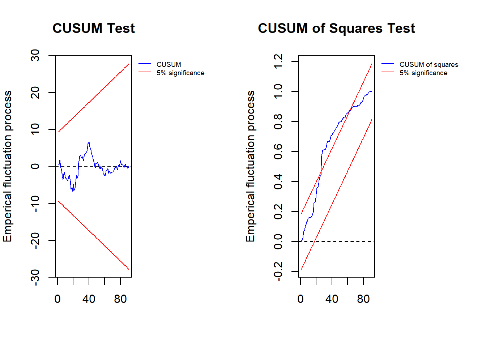

# NARDL


```r
# install.packages("ardl.nardl")
library(ardl.nardl)
#> Warning: package 'ardl.nardl' was built under R version
#> 4.2.3
#> Registered S3 method overwritten by 'quantmod':
#>   method            from
#>   as.zoo.data.frame zoo
```


```r
# Data
datanardl <- read.csv("Data/Bab 9/datanardl.csv")
head(datanardl)
#>       date price.Vietnam price.China
#> 1 1/1/2002           115    143.7978
#> 2 2/1/2002           105    129.4568
#> 3 3/1/2002           100    127.9081
#> 4 4/1/2002           117    149.8740
#> 5 5/1/2002           103    131.0987
#> 6 6/1/2002           113    145.1878
```


```r
# Phillips-Perron Unit Root Test
PP.test(datanardl$price.Vietnam)
#> 
#> 	Phillips-Perron Unit Root Test
#> 
#> data:  datanardl$price.Vietnam
#> Dickey-Fuller = -5.6063, Truncation lag parameter =
#> 3, p-value = 0.01
PP.test(datanardl$price.China)
#> 
#> 	Phillips-Perron Unit Root Test
#> 
#> data:  datanardl$price.China
#> Dickey-Fuller = -5.0955, Truncation lag parameter =
#> 3, p-value = 0.01
```


```r
# Auto Selecet Model
model1 <- gets_nardl_uecm(x =  datanardl,
                          decomp = 'price.China',
                          dep_var = 'price.Vietnam',
                          p_order = c(5),
                          q_order = c(5),
                          graph_save = TRUE,
                          case = 3,
                          F_HC = TRUE)
#> Percentage of positive changes in decomp is 56 percent while negative change is 44
```




```r
# Cointegratio Test
model1$cointegration$Fstat
#>                    observation k    fstat case lower.b
#> 10% critical value          91 1 10.88198    3    4.04
#> 5% critical value           91 1 10.88198    3    4.94
#> 1% critical value           91 1 10.88198    3    6.84
#>                    upper.b
#> 10% critical value    4.78
#> 5% critical value     5.73
#> 1% critical value     7.84
```


```r
# NARDL Form
summary(model1$Parsimonious_NARDL_fit)
#> 
#> Call:
#> lm(formula = price.Vietnam ~ price.Vietnam_1 + price.Vietnam_3 + 
#>     price.Vietnam_4 + price.Vietnam_5 + price.China_pos + price.China_pos_1 + 
#>     price.China_pos_2 + price.China_pos_4 + price.China_pos_5 + 
#>     price.China_neg + price.China_neg_1 + price.China_neg_4 + 
#>     price.China_neg_5, na.action = na.exclude)
#> 
#> Residuals:
#>      Min       1Q   Median       3Q      Max 
#> -16.3047  -4.4665  -0.3095   4.0691  21.2637 
#> 
#> Coefficients:
#>                   Estimate Std. Error t value Pr(>|t|)    
#> (Intercept)       66.70011   14.83287   4.497 2.40e-05 ***
#> price.Vietnam_1    0.52746    0.09462   5.575 3.52e-07 ***
#> price.Vietnam_3    0.14052    0.10138   1.386  0.16974    
#> price.Vietnam_4   -0.03782    0.10453  -0.362  0.71847    
#> price.Vietnam_5   -0.14259    0.09817  -1.452  0.15043    
#> price.China_pos    0.08230    0.18191   0.452  0.65223    
#> price.China_pos_1 -0.28087    0.22492  -1.249  0.21553    
#> price.China_pos_2  0.19196    0.17400   1.103  0.27338    
#> price.China_pos_4 -0.26694    0.19885  -1.342  0.18341    
#> price.China_pos_5  0.25245    0.16491   1.531  0.12991    
#> price.China_neg    0.04123    0.15263   0.270  0.78778    
#> price.China_neg_1  0.05460    0.17787   0.307  0.75969    
#> price.China_neg_4 -0.50597    0.17240  -2.935  0.00440 ** 
#> price.China_neg_5  0.41552    0.15347   2.708  0.00835 ** 
#> ---
#> Signif. codes:  
#> 0 '***' 0.001 '**' 0.01 '*' 0.05 '.' 0.1 ' ' 1
#> 
#> Residual standard error: 7.061 on 77 degrees of freedom
#> Multiple R-squared:  0.5657,	Adjusted R-squared:  0.4923 
#> F-statistic: 7.714 on 13 and 77 DF,  p-value: 1.571e-09
```


```r
# NARDL ECM Form
summary(model1$Parsimonious_ECM_fit)
#> 
#> Call:
#> lm(formula = D.price.Vietnam ~ price.Vietnam_1 + price.China_pos_1 + 
#>     price.China_neg_1 + D.price.Vietnam_2 + D.price.Vietnam_3 + 
#>     D.price.Vietnam_4 + D.price.China_neg_4, na.action = na.exclude)
#> 
#> Residuals:
#>      Min       1Q   Median       3Q      Max 
#> -16.0510  -5.0380  -0.3461   3.9997  23.1158 
#> 
#> Coefficients:
#>                       Estimate Std. Error t value Pr(>|t|)
#> (Intercept)         61.8968384 11.5905403   5.340 7.95e-07
#> price.Vietnam_1     -0.5138343  0.0903867  -5.685 1.90e-07
#> price.China_pos_1   -0.0192273  0.0771006  -0.249   0.8037
#> price.China_neg_1    0.0003975  0.0741449   0.005   0.9957
#> D.price.Vietnam_2    0.0790419  0.0929207   0.851   0.3974
#> D.price.Vietnam_3    0.2409279  0.0963186   2.501   0.0143
#> D.price.Vietnam_4    0.1413008  0.0922292   1.532   0.1293
#> D.price.China_neg_4 -0.5632653  0.1217687  -4.626 1.36e-05
#>                        
#> (Intercept)         ***
#> price.Vietnam_1     ***
#> price.China_pos_1      
#> price.China_neg_1      
#> D.price.Vietnam_2      
#> D.price.Vietnam_3   *  
#> D.price.Vietnam_4      
#> D.price.China_neg_4 ***
#> ---
#> Signif. codes:  
#> 0 '***' 0.001 '**' 0.01 '*' 0.05 '.' 0.1 ' ' 1
#> 
#> Residual standard error: 7.093 on 83 degrees of freedom
#> Multiple R-squared:  0.4579,	Adjusted R-squared:  0.4122 
#> F-statistic: 10.01 on 7 and 83 DF,  p-value: 5.192e-09
```


```r
# Long Run Coefficients
model1$Longrun_relation
#>                        Estimate Std. Error      t value
#> price.China_pos_1 -0.0374192226  0.1505206 -0.248598606
#> price.China_neg_1  0.0007735328  0.1442840  0.005361181
#>                    Pr(>|t|)
#> price.China_pos_1 0.8042781
#> price.China_neg_1 0.9957351
```


```r
# Long Run Asymetric Test
model1$longrun_asym
#>                Fstat       Pval
#> price.China 5.031109 0.02756084
```


```r
# Short Run Asymetric Test
model1$Shortrun_asym
#>                Fstat         Pval
#> price.China 21.39708 1.359712e-05
```

