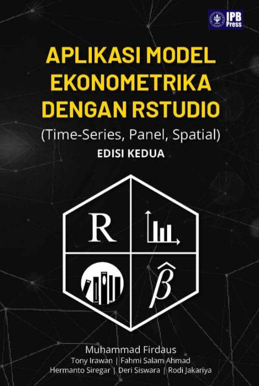

--- 
title: "Application of Econometric Models with RStudio"
author: "Deri Siswara"
# date: "2024-04-02"
site: bookdown::bookdown_site
documentclass: book
bibliography: [book.bib, packages.bib]
description: |
  This is a minimal example of using the bookdown package to write a book.
  The HTML output format for this example is bookdown::bs4_book,
  set in the _output.yml file.
biblio-style: apalike
csl: chicago-fullnote-bibliography.csl
---

# Welcome {-}

This is the code version of *Application of Econometric Models with RStudio*, a book released in 2023 by IPB Press. The book was written by Muhammad Firdaus, Tony Irawan, Fahmi Salam Ahmad, Hermanto Siregar, Deri Siswara, and Rodi Jakariya. You can order the full version [here](https://bit.ly/buku-jurnal-rstudio2), which includes more detailed explanations.

This book aims to help students and researchers apply econometric models in analysis using RStudio software. It begins with an introduction to the use of R programming language and RStudio as an IDE. The book covers topics on theory and application of OLS models, including testing Gauss-Markov conditions. Additionally, it presents the application of time-series models such as ARMA, GARCH, VAR, VECM, ARDL, SVAR., static and dynamic panel data analysis using RStudio's instruments that accommodate heteroscedasticity and autocorrelation assumptions. Finally, there is a discussion of spatial model applications for analysis with spatial or regional elements. In this latest publication update includes three additional chapters: spillover analysis on time series data; DCC-GARCH; Non-linear ARDL. Updates will be made frequently. 

This book may contain bugs/errors which readers can report at *Buku.rstudio.ipb@gmail.com*
